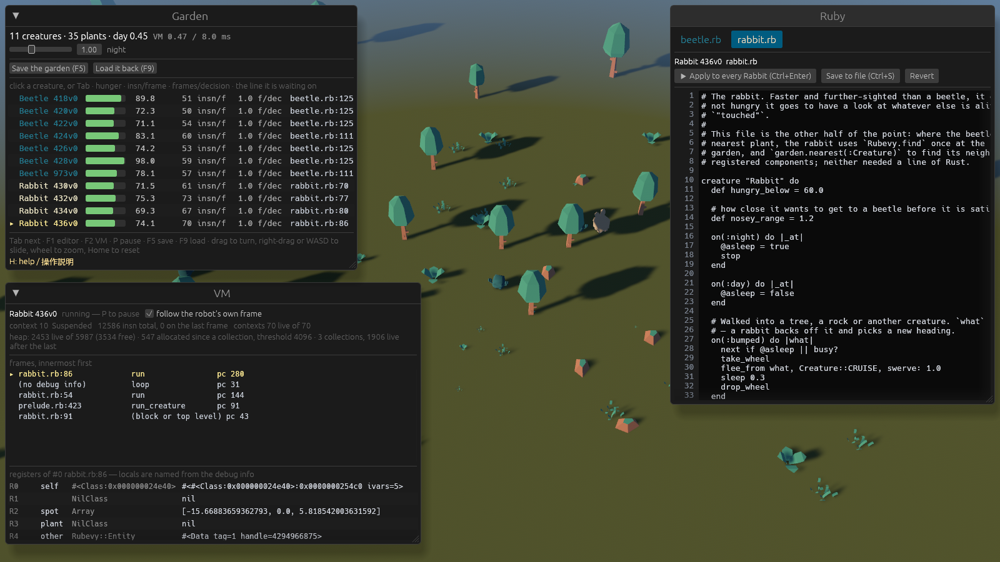
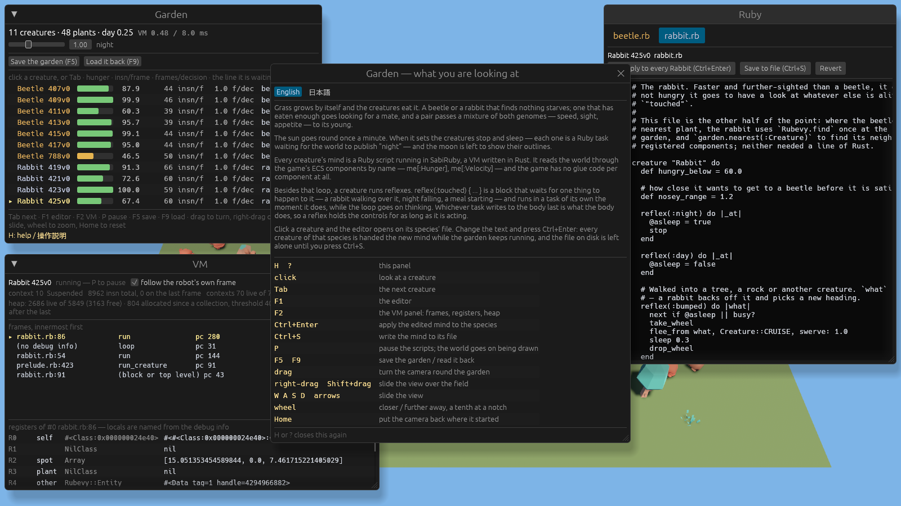
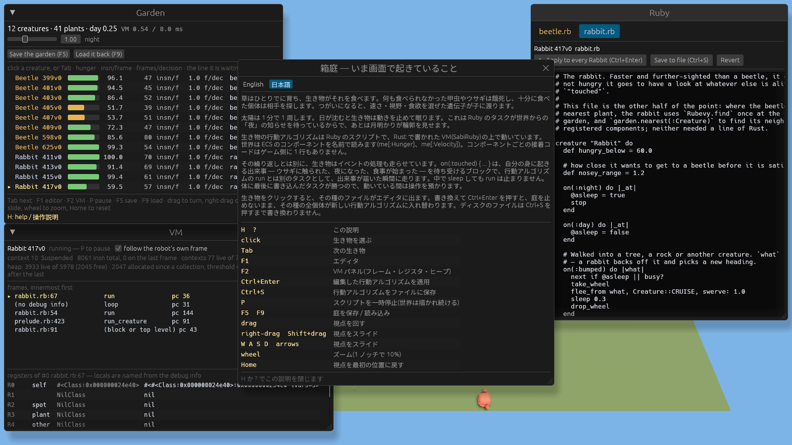
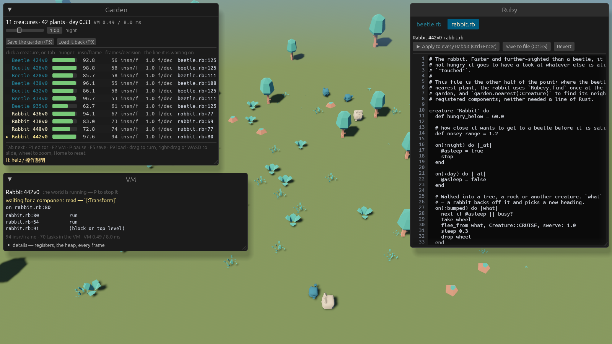
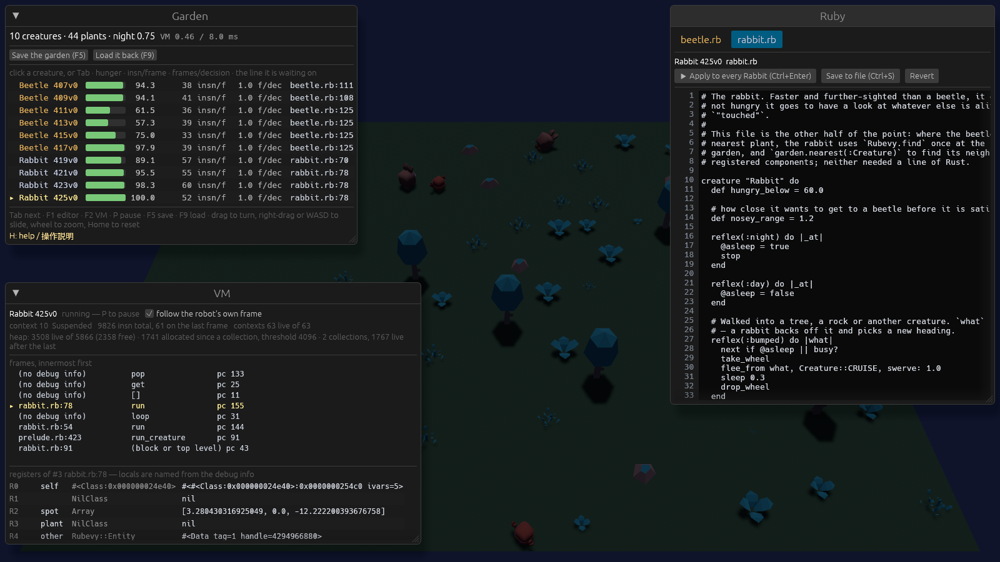
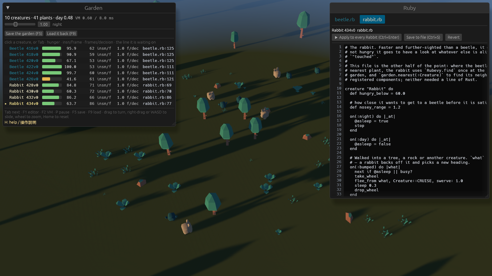

# Garden

The second sample in this repository, and the opposite of SabiRuby Battle. In Battle the rules are
Rust and a robot's behaviour talks to them through one string channel (`Rubevy.ask`); the ECS is never
mentioned on the Ruby side. Here **the Ruby reads and writes the ECS components themselves, by
name** — `me[:Hunger]`, `plant[:Transform][:translation]`, `me[:Velocity] = [[vx, vz]]` — and the
game writes no glue for any of it.

It is 3D: a plane of grass, creatures on it, trees and rocks they cannot walk through, and one sun
that goes round once a minute and casts the shadows. That is Bevy being Bevy; what it costs the Ruby side is two lines, and they are listed
below.



**This file describes stages G0 to G9 and W1 to W3** (`docs/plans/garden-plan.md`,
`docs/plans/garden-world-plan.md`): the
world, the models in it, the two kinds of behaviour — a Ruby task per creature and a task per handler —
the `Genome`, a Rust struct that is also a Ruby class, which the creatures mix and mutate to
breed, the save file, which is the world and every creature's own memory as JSON, the window —
a creature's file rewritten while the garden runs, the whole world stopped with `P` and the VM
looked into while it stands still, and a
HUD that says what a decision costs — and the browser build, which is the same game at
<https://sabiruby.github.io/rubevy_games/garden/> — and, since W1, **the rules themselves**: the
grass, hunger, eating, pairing and starving are `ruby/world.rb` in a second VM, edited with `F3`
and `Ctrl+Enter` like a creature's file and swapped without stopping the garden.

```
cargo run -p garden                                     # a window
cargo run -p garden -- --headless 90                    # no window, 90 seconds, the result on stdout
GARDEN_SELFTEST=1 cargo run -p garden -- --headless 90  # and the thirteen checks
GARDEN_SELFTEST=1 cargo run -p garden                   # a window, and the editor's and the keys'
cargo run -p garden -- --headless 30 --save g.json      # and write the garden down at the end
cargo run -p garden -- --load g.json                    # and pick it up again
GARDEN_SELFTEST=1 GARDEN_RELOAD_AT=20 cargo run -p garden -- \
    --headless 20 --load g.json --save h.json           # F9's path, with no keyboard to press
cargo run -p garden -- --shot docs/garden.png 22        # a window, one picture at 22 s, and out
cargo run -p garden -- --shot n.png 12 --at midnight    # the same, with the sun where it is at midnight
cargo run -p garden -- --shot c.png 12 --eye 18         # …from 18 units back instead of 42
cargo run -p garden -- --shot g.png 10 --guide --lang ja  # …with the H panel open, in Japanese
cargo run -p garden -- --shot v.png 15 --vm             # …with the VM panel open (G9; it is closed otherwise)
web/build.sh garden && web/serve.sh                     # the browser build, at .../garden/
```

On WSL without a GPU driver the windowed mode and `--shot` go through the container in `docker/`
(`docs/wsl-gpu.md`); `--headless` needs nothing. `docker/run.sh` is written for sabibots and names
its volumes, so the garden's picture above was taken with the same `docker run` spelled out by
hand against volumes of its own.

## Keys

| | |
|---|---|
| left-drag | turn the camera round the garden |
| right-drag, or Shift and left-drag | slide the view over the field (G6) |
| W A S D, or the arrow keys | the same, without a mouse (G6) |
| wheel | closer / further away: a tenth of the distance per notch (G6) — unless the pointer is over a panel, and then it is the panel's (2026-09-18) |
| Home | put the camera back where it started (G6) |
| click a creature | look at it: the HUD marks it, the editor shows its file, the VM panel its task |
| Tab | the next creature |
| H, or ? | the in-game guide, in English or Japanese — the buttons at its top switch (G6, G6b) |
| F1 | the editor |
| F2 | the VM panel — **closed until it is asked for** (G9) |
| F3 | the rules of the world — `ruby/world.rb` in the editor (W3) |
| P | **stop the world** (G9): every rule of the garden and the VM both; the garden keeps drawing |
| Ctrl+Enter | Apply: run the edited text in every creature of that species — or, on `world.rb`, in the world |
| Ctrl+S | Save: write it to `beetle.rb` / `rabbit.rb` / `world.rb` |
| F5 | write the garden to `garden.save.json` (G3) — the HUD has a button for it too |
| F9 | read it back (likewise) |

In a browser the same keys do the same things (the page takes F5 back from the browser, which
would otherwise reload it), and the two buttons in the HUD are what a player who has not read this
finds. `docs/web.md` has the rest. The window itself is described under **The window (G4)** below.

### A wheel turned over a panel is the panel's (2026-09-18)

The author scrolled the editor's listing and the garden zoomed out underneath it. A drag inside a
panel had been the panel's since G4 and a key typed into the editor since G4; the wheel was the one
gesture nobody had asked egui about, so `orbit_camera` read every `MouseWheel` while egui read the
same message for its `ScrollArea`, and both happened at once.

What is asked now is `wants_pointer_input() || is_pointer_over_area()`, which is a wider question
than the drag's was: egui's own `wants_pointer_input` is `is_using_pointer() || (is_pointer_over_area()
&& no button is down)`, so a pointer resting on a panel with a button held is not "wanted" by egui
and a wheel turned there would have come back to the camera. Over an area is over an area.

Widening it would have cost the drags something — a turn begun on the grass and swept across the
editor would stop dead half way — so **a drag is decided when the button goes down**: one that
began on the garden stays the camera's wherever the pointer goes afterwards, and one that began on
a panel never becomes the camera's however far it is dragged out. That is what the old code did by
accident, through the `any_down` in egui's own definition; it is said on purpose now.

SabiRuby Battle reads no mouse at all — its camera is fixed and the arena is scaled to the window
— so there was nothing of the same shape to fix there.

### The wheel had two steps in it, and the unit is why (G6)

The author played the browser build and found the wheel did one thing: all the way in, or all the
way out. It was right on the machine the code was written on and wrong on a page, and the reason
is in the *unit* a wheel message carries.

Bevy's `MouseWheel` has a `unit` field, and until G6 nothing here read it. A mouse on a PC sends
lines — winit hands over `MouseScrollUnit::Line` with `y = ±1.0` per notch. A browser sends
pixels: a `wheel` event's `deltaY` is how far the page would scroll, and one notch of a real mouse
in Chromium is **100** of them. The old line was

```rust
orbit.distance = (orbit.distance - w.y * 2.0).clamp(12.0, 90.0);
```

so one notch was two units on a PC and two hundred in a browser, against a range 78 units wide.
Two steps, and the second one was the clamp.

So a message becomes a number of **notches** first, and the notches are a *ratio* rather than a
subtraction:

```rust
fn notches_of(unit: MouseScrollUnit, y: f32) -> f32 {
    match unit {
        MouseScrollUnit::Line => y,
        MouseScrollUnit::Pixel => y / PIXELS_PER_NOTCH,   // 100.0
    }
}

fn zoom_by(distance: f32, notches: f32) -> f32 {
    (distance * ZOOM_PER_NOTCH.powf(-notches)).clamp(ZOOM_MIN, ZOOM_MAX)   // 1.10, 6.0, 110.0
}
```

A ratio is the whole point of the second one: ten per cent is the same felt step at 8 units as at
80, which a fixed subtraction cannot be — it is either too coarse close in or too slow far out.
Thirty notches cross the range either way, in both builds, which is about ten flicks of a finger.
The two functions are pure and have tests of their own in `garden/src/main.rs`, because the bug
they fix is invisible in every environment a test runs in.

### Panning

The field is forty by thirty and the camera used to be nailed to the middle of it: a beetle in a
corner was something you could turn *towards* and never go *to*. `Orbit` grew a fourth number —
`focus`, the point on the ground the camera turns around and looks at — and `camera_at` places the
eye relative to it instead of relative to the origin.

Which button does which is the only decision in it. Left-drag turns, and right-drag or Shift and
left-drag slide; the right button is there because it is the usual one, and Shift and left because
a trackpad may not have a right button and a browser may want the right one for its own menu. The
drag is turned by the camera's yaw before it is added (`ground_axes`), so sliding goes where the
eye expects rather than where the world's X happens to be, and it is scaled by the distance, so it
feels the same close in as far out. `Home` puts all four numbers back.

### What the browser actually does, measured

`GARDEN_SELFTEST=1` — or `?selftest` in the page's address — makes the camera write a line every
time a wheel message arrives and a sampled line while it is being dragged. That is the only way to
read a camera out of a wasm canvas from outside, and it is what these numbers come from; an
ordinary run logs nothing. Driven in headless Chromium 153 (playwright, software WebGL) against
`web/dist/garden/?selftest`, ten `mouse.wheel(0, -100)` one at a time:

```
wheel Pixel y=100 -> 1.000 notches, distance 42.00 -> 38.18
wheel Pixel y=100 -> 1.000 notches, distance 38.18 -> 34.71
wheel Pixel y=100 -> 1.000 notches, distance 34.71 -> 31.56
… 28.69, 26.08, 23.71, 21.55, 19.59, 17.81 …
wheel Pixel y=100 -> 1.000 notches, distance 17.81 -> 16.19
distinct distances: 10 of 10
```

**Ten notches, ten steps**, each exactly a tenth of the one before, where the author found two —
and the unit in the log is the evidence for the diagnosis rather than a guess about it: `Pixel`,
100 per notch, which is exactly what `PIXELS_PER_NOTCH` says. Ten notches back out land on 42.00
again to the last digit. A right-drag of 180 px right and 96 px down moves `focus` to
`(-11.09, -5.91)`; holding `W` for 0.7 s moves it to `(-12.10, -15.72)`; `Home` puts it at
`(0.00, 0.00)`. The page's own 21 window checks pass in the same run, with no page error. The
driver is in `docs/worklog/2026-09-17-garden-G6.md`.

### The guide in the game, in one language at a time (G6, G6b)

The author played the browser build knowing what every key did, and still wrote down "there is no
explanation in the game". Until G6 the whole of it was one weak grey line at the foot of the HUD
and the file you are reading, in another window. So: a panel, **open the first time the game
starts**, `H` or `?` after that (`Esc` closes it), and a hint in the HUD in the colour the key
names are, saying so.




Five paragraphs and the key table. The paragraphs are not the key list in prose — they are what
somebody who has just opened the page is actually looking at (grass, hunger, a day that turns over
in a minute, creatures pairing off), and then the three things a player would never guess: that
every behaviour is a Ruby script in a VM written in Rust that reads the ECS components by name, that a
creature also runs **handlers** — a block that waits for one thing to happen to it and runs in a
task of its own the moment it does, while the main loop goes on thinking — and that clicking a
creature and pressing Ctrl+Enter hands the new behaviour to every creature of its species while the
garden keeps running.

**One language at a time** (G6b). G6 put the English and the Japanese one under the other all the
way down the panel, and the author's second play said what anybody would: half of what is on the
screen is not for you, whoever you are. So the two buttons at the top, `English` / `日本語`, pick
one — each written in its own language, so that neither reader has to recognise a word in the
other's — and the key table lost a column with them. Which language the panel opens in is:

| | |
|---|---|
| `--lang en` / `--lang ja` | what the command line asked for, and it is **not** remembered: a picture taken in Japanese should not change what the next player sees |
| else, what was clicked last time | `garden.settings.txt` beside the save, or in a browser the `localStorage` key `garden:garden.settings.txt` |
| else, the machine's own | `LC_ALL`/`LANG` on a PC, `navigator.language` in a browser; anything starting with `ja` is Japanese, anything else is English |

The hint in the HUD stays in **both** languages (`H: help / 操作説明`): it is the one line that has
to be understood before anybody has chosen anything.

The **frame** is `rubevy-arena`'s (`crates/rubevy-arena/src/guide.rs`): the window, the two keys,
the switch and the font. The **words** are each game's, and each game keeps all of them in one
file and nothing else in it — **the switch changed none of them**, since a paragraph and a key row
each carry both languages as they always did and only the drawing chooses:

| | |
|---|---|
| `garden/src/guide_text.rs` | the garden's words — the file to edit to change them |
| `sabibots/src/guide_text.rs` | SabiRuby Battle's |
| `crates/rubevy-arena/src/guide.rs` | the strings both games show: the HUD's `H: help / 操作説明`, the two buttons, and the line at the foot of the panel |

`--shot` starts with the panel shut, since a picture is asked for one thing and the panel sits
over the middle of the window; the two pictures above are
`cargo run -p garden -- --shot docs/garden-guide.png 10 --guide --lang en` and the same with
`--lang ja`, and looking at them is how "the Japanese is not tofu" was checked.

### The font, and re-cutting it when the words change

egui's default fonts are Ubuntu-Light and two Noto *symbol* faces: **no CJK at all**. Japanese in
a label is the replacement box — tofu — and there is no system font to fall back on, because the
browser build is a wasm module with no access to the machine's fonts and font discovery would be a
megabyte of code and a different answer on every machine. So the font is in the binary:

```rust
pub const CJK: &[u8] = include_bytes!("../assets/fonts/NotoSansJP-Guide.subset.ttf");
```

Noto Sans JP (SIL Open Font License 1.1; `CREDITS.md`, with `OFL.txt` beside the file), which is
9.6 MB as it comes — a variable font with the whole `wght` axis and every Japanese glyph. What is
in the binary is **65,904 bytes**: pinned to one weight, and cut down to the 334 characters the
guides actually use (G6 was 62,780 bytes and 327 characters; G6b's paragraph about
handlers and the `日本語` button between them brought fourteen new ones —
`ブ勝受始専届後瞬繰自語身返預` — and dropped one, the `·` that only the old bilingual footer
used; G7 renamed 「頭脳」to 「行動アルゴリズム」 and 「反射」to 「イベントの処理」, which
brought `ゴベ処理` and took `う反専応考脳頭` away — 337 characters down to 334, and the file
smaller for the first time; the script found all of that by itself by reading the three files
again). It is added as a **fallback**, appended to both of egui's families rather
than replacing them, so egui reaches it only for characters the defaults do not have and every
Latin glyph in the editor and the panels is what it was.

Cutting the font to the text means the two have to be cut **together**:

```
tools/subset-font.sh          # after editing any Japanese in the three files above
cargo build --release -p garden -p sabibots
web/build.sh all              # for the pages
```

The script reads the characters out of those three files itself, fetches Noto Sans JP if it is not
given a path to one, pins `wght=400` with `fontTools.varLib.instancer` and subsets with
`fontTools.subset` (fonttools 4.65 in a venv). **A Japanese word edited into a guide without
running it is drawn as blank boxes**, because the character is not in the subset — which is the
one way this arrangement can go wrong, and the reason the script exists rather than a note saying
which font was used.

## The components

This table is the Ruby API. Nothing else in `garden/src/main.rs` mentions Ruby except five
`ScriptWorld::publish` calls, the system that answers the two questions below, and the two lines
that hang a compiled script on a creature. There is **no per-component code at all** — not in
rubevy, which walks Bevy's type registry, and not in the game, which resolves the one component
name a script may pass it the same way. So the whole of what it takes for a component to be
readable from Ruby is `#[derive(Component, Reflect)]`, `#[reflect(Component)]` and
`app.register_type::<T>()` (rubevy `docs/host-api.md`, "Components by name"), and that count — one
line, the registration — is the number the plan asks for.

| component | fields | as Ruby sees it | what the rules do with it |
|---|---|---|---|
| `Plant` | `size: f32` | `{size: 0.42}` | grass. `ruby/world.rb` grows it by 0.06/s up to 1.4, takes a bite out of it and despawns what is left under 0.02. No `Collider` — walking into grass is how it is eaten |
| `Tree` | — (unit) | `{}` | an obstacle, not food. Fixed, with a `Collider` |
| `Rock` | — (unit) | `{}` | the same, lower down |
| `Collider` | `radius: f32` | `{radius: 0.4}` | how much room a solid thing takes on the ground. Creatures, trees and rocks have one |
| `Creature` | `species: Species`, `age: f32`, `genome: Genome`, `parent: Option<Entity>` | `{species: :Beetle, age: 12.5, genome: {…}, parent: {Some: [<Entity>]}}` | `age` is counted up by the rules themselves, which is what makes `age == 0.0` mean "no pass has touched this one yet"; `parent` is who asked for it, and the two together are how `world.rb` finds a creature that has just been born (W2). `genome` is what the rules read for the top speed, the sight radius and the hunger rate (G2, below) |
| `Hunger` | `f32` (tuple) | `[62.3]` | 100 is full, 0 is dead. `world.rb` empties it at 1.6/s × the creature's `appetite`, fills it by eating, charges 30 of it for a child, and despawns the creature at 0 |
| `Velocity` | `Vec2` (tuple) | `[[1.2, -0.7]]` | integrated into `Transform` on XZ, clipped to the creature's top speed, stopped by the walls |
| `Sight` | `f32` (tuple) | `[8.0]` | how far `garden.nearest(:Plant)` looks for the creature that asked. It is set at birth from the creature's own `genome.sight`, which starts near 8 for a beetle and 12 for a rabbit |
| `Memory` | — (unit) | `{}` | that this creature remembers things. It stayed a marker at G3, which is the finding rather than an omission: what it remembers is a Ruby Hash in the VM, and the save file reads it from there (below) rather than keeping a second copy here |
| `Breeding` | `ready_at: f32`, `partner: Entity` | `{ready_at: 41.2, partner: <Entity>}` | **written from Ruby** (W2): the earliest the rules may tell this creature about a partner again, in the garden's own clock (`garden.now`), and who it was last told about, so that a child can be charged to both parents. "Nobody" is `Entity::PLACEHOLDER` rather than `None`, because a Hash cannot turn a `None` into a `Some` (below) |
| `Transform` | Bevy's | `{translation: [x, y, z], rotation: [...], scale: [...]}` | position, facing and — for a plant — its size again, as `scale`, written by `plants_wear_their_size` from the number `world.rb` set |

`Species` is a field-less enum and is registered too, so it reads as a Symbol: `:Beetle`,
`:Rabbit`. `Genome` is a struct nested inside `Creature`, and reflection walks into it without
being asked — which is how the same three numbers that a Ruby object has methods for are also a
plain Hash (see **The genome** below). `Transform` is registered by hand because `MinimalPlugins` (the headless run) does not
register it and `DefaultPlugins` does.

**What is deliberately *not* in the table.** `Sun`, `Mind`, `Eating`, `Animated`, `Fasting`, `WorldScript` and
`Probe` are components of the game that derive neither `Reflect` nor anything else, and are not
registered. A type nobody registered reads as `nil` from Ruby, answers `false` to `has?` and is
absent from `components` — so *not registering* is the whole of the access control there is, and
it is enough. `Mind` (what a script has cost) and `Animated` (which clip its model is playing)
are the interesting two: a creature cannot read its own instruction count, and cannot tell that
it has a model at all.

## The rules

**Every rule is Ruby** (W1, W2). `garden/ruby/world.rb` is the grass, hunger, eating, starving,
pairing and the child; the numbers are in it too, and it is edited in the same panel a creature's
file is edited in, with `F3` and `Ctrl+Enter`, while the garden goes on running. It was five Rust
systems and a dozen `const`s nobody outside the source could reach; what is left in Rust is the
*mechanics*, and the line between the two is the whole of this stage:

| Ruby — `ruby/world.rb`, one pass per frame | Rust — `garden/src/main.rs`, each frame |
|---|---|
| the grass: grows, is capped, sprouts (and how often depends on the season) | `day_night` — turns the sun, recolours it, the ambient light and the sky, on the `day_length` the rules handed over. Publishes `"night"` / `"day"` |
| hunger: falls by the creature's `appetite`, rises by eating, kills at 0 | `move_creatures` — `Velocity` into `Transform` on XZ, top speed, walls, facing |
| eating: what is in reach, how big a bite is, what it is worth | `separate` — nothing walks through anything solid; publishes `"bumped"` |
| pairing: how full, how near, how long a cooldown, what a child costs | `startle` — a rabbit within 1.3 of a beetle; publishes `"touched"` |
| the seasons (`every 60`), and what the world says out loud (`tell`) | `answer_world` / `answer_garden` — the questions either VM may ask |
| `day_length`, `child_hunger` and `pop_max`, handed to the game once by `garden.rules` | `sprout_plants`, `children_arrive` — the **bodies** the rules asked for: where a seed lands, what a newborn is made of |
| | `plants_wear_their_size`, `note_the_rules` — the drawing of a number the rules wrote, and what a rule *did* to the world, read from outside |
| | `watch_minds` — each script's instruction count and the line it stands on |

and one system runs at `Startup` and never again: `install_genome`, which is
`Genome::register(&mut world.vm)` — the whole of putting a class of the game's own in the VM.

The rules despawn a creature with `Rubevy.despawn`, and that is all anything does about the script
that was on it: removing an entity removes its `ScriptTask`, and rubevy's `on_remove` hook
terminates the task in the VM and closes the queues anything of its was parked on, which raises
`Rubevy::Unsubscribed` in a handler task instead of leaving it standing for ever (rubevy
`docs/host-api.md`, "Events"). A creature that starves therefore takes its behaviour and its
handler tasks with it, and nothing in either file says a word about that.

`publish` to a name nobody has subscribed to does nothing at all, which is why the game may
publish freely — all of these were already wired up in G0, when nothing in the world was
listening, and G1 added no `publish` call at all.

**Three of the numbers above are in two places on purpose.** `DAY_LENGTH`, `CHILD_HUNGER` and
`POP_MAX` are still `const`s in `main.rs`, because the game has to have an answer before
`world.rb` has spoken — and for ever, in a garden whose `world.rb` will not compile. `PLANT_MAX`
and `HUNGER_MAX` are in both files saying two different things: here they are what the world is
*built* with and what a bar draws as full, there they are what a rule stops at.

## The world's own VM (W1, W2)

There are **two SabiRuby VMs in the binary**, and the second one is the rules. rubevy takes a type
as a name tag — `RubevyPlugin::<World>::for_vm(dir)`, `ScriptWorld<World>`, `RubevySet::<World>::tick()`
— and the tag implements nothing, holds nothing and costs nothing at run time (rubevy
`docs/host-api.md`, "Two VMs in one app"). The creatures' VM is the app's first and is spelled
exactly as it always was.

It is two rather than one more task in the first because the rules and the creatures are **two
pieces of somebody else's writing and the editor swaps either without the other**: a `world.rb`
that runs away must not be able to spend the beetles' frame, and a constant one of them defines
must not be able to reach the other. What it costs is that a message published in one does not
reach the other, which is why `tell` goes through Rust.

### The order of the two ticks is the whole arrangement

Nothing in rubevy orders two VMs against each other; each plugin chains its own three sets and no
more. Three lines in `main` do it, and the garden depends on every one:

```
the Rust mechanics  →  the world's tick  →  the world's answers  →  the creatures' tick
```

* the mechanics are `.before(RubevySet::<World>::tick())`, because a `Transform` they have just
  written is the `Transform` `garden.within` measures from, in the same frame;
* the world's tick is `.before(RubevySet::Tick)`, so a `Hunger` the rules worked out this frame is
  the `Hunger` a beetle reads in the *same* frame's tick — a read is answered inside the tick that
  asks it (`docs/worklog/2026-09-17-sync-reads.md`);
* the world's **answers** are `.before(RubevySet::Tick)` too, and that is what makes `tell` arrive
  in the frame it was said rather than the one after.

The world's tick also carries the `is_still` run condition the deleted rule chain used to carry,
so `P` and a save being read back stop the rules the way they stopped the systems.

### One pass is one frame

```ruby
each_frame do |dt|   # every blade, every creature, once
```

is a loop that waits on `Rubevy.ask("frame")`, and one round trip is one frame. It works because
that is the **only** thing the rules ask that costs a frame (the table under **The questions**),
so the count comes out exact: over a ninety-second run, 5,373 frames and 5,372 passes, the two
missing ones being the script starting up.

`every 60 do |n| … end` is a second task in the same VM that only sleeps; the scheduler already
has "a task asleep until a time", and it is the same clock that makes a creature's `sleep 0.2`
mean something — so a pause stops the seasons too, and eleven seconds left of a season is eleven
seconds left after the pause. A timer has no subscription to lose, so ending the world's task does
not end it: `run_world` writes `$world_being`, and a timer that wakes to find somebody else's
there stops itself. That is one line, and without it a `world.rb` replaced in the editor leaves
its seasons ticking behind it.

`tell :all, "season", "wet"` is a question `answer_world` turns into `ScriptWorld::publish` on the
creatures' VM. What arrives is indistinguishable from what `startle` or `day_night` publishes,
because it is the same function — so `on(:season)` in `beetle.rb` needed no new machinery at all.

### The budget, and where the number comes from

The budgets are **per VM and nothing caps them together**: two VMs at rubevy's defaults would
allow 16 ms in one frame, which is the whole of one at 60 Hz. So the second VM has a number of its
own, and it is a measurement.

The rules cap their own world — `world.rb` holds the grass at 90 blades and `pop_max` holds the
creatures at 24 — so there is a worst case and it can be sat in. A build rigged to start with more
grass than the rules allow and a full population, three runs of a minute, 392 frames with the
field at 90 blades and 24 creatures on it:

| | median | 99th frame in a hundred | worst |
|---|---|---|---|
| instructions in one pass | 24,670 | 25,782 | 25,837 |
| the world's tick | 2.65 ms | 4.60 ms | 4.86 ms |

`budget = 45_000` is **1.74× the worst of those**, and a little under a quarter of the creatures'
200,000 — which says in one number which of the two VMs is the guest. `frame_time` is left at
rubevy's 8 ms: at about 9,300 instructions to the millisecond, 45,000 is roughly 4.8 ms, so **the
instruction count is what bites first**, and that is the right way round. Instructions are a fact
about the rules and are the same number in a browser several times slower; milliseconds are a fact
about whichever machine is running them.

(W1 chose the same number from a straight-line fit of cost against population, read off at a
garden of twice the caps. W2's pairing is a search over the creatures that are full enough rather
than a pass over all of them, and the fit stopped describing it — 5% residual where it had been
0.9%, and 22% under the truth at the caps. The number did not move; what it rests on did.)

### What the rules do not keep

**The world's state is not in the save file.** `@season` is an instance variable of the object
`world.rb` made, and the game writes down the garden — plants, creatures, genomes, each creature's
own `@memory` — and not the rules' bookkeeping. So `F9` opens a garden whose season is whatever
the rules start in, and `Ctrl+Enter` does the same, for the same reason a beetle handed a new
behaviour has forgotten what it ate. What *is* kept is everything the rules wrote into components:
a `Breeding` cooldown outlives the rule that set it, which is most of why it is a component.

**A `world.rb` that will not compile is not a reason to refuse to start.** It is a file the player
is invited to edit. The garden runs: the sun turns, the creatures walk and push each other about,
the grass does not grow and nobody gets hungry — and the HUD says so in one line. Measured, with a
syntax error in it and with the file missing:

```
the world has no rules: world.rb: world.rb:214:3: syntax error, unexpected 'end', …
the world has no rules: …/garden/ruby/world.rb: No such file or directory (os error 2)
```

## Solid things

Creatures, trees and rocks do not pass through one another. There is no physics crate: avian or
rapier would be a megabyte of wasm, a second vocabulary and a set of rules the reader cannot see.
What there is instead is a circle on XZ per solid thing (`Collider { radius }`) and one system that
runs after the move:

* neighbours come out of a grid of 1.6-unit cells (`HashMap<(i32, i32), Vec<usize>>`), so the work
  is the pairs that are actually near each other rather than every pair. At a dozen creatures that
  is a wash; it is written that way because the world is meant to grow;
* a pair whose centres are closer than the sum of their radii is pushed apart until they only
  touch — **half each between two creatures, all of it on the creature when the other thing is a
  tree or a rock**, which is what makes an obstacle an obstacle;
* **and a wall is an immovable thing too**: what the wall will not let one of a pair have is
  handed to the other, so the pair still settles the whole of the push between them. That is the
  same sentence as the tree's, said of the edge of the world. It was not always: until
  2026-09-18 the halves were taken without asking the wall and the write-back clamped whoever had
  gone through one back inside — straight into the other creature, which is exactly what the
  fourth check kept catching (`docs/worklog/2026-09-17-selftest-flakes.md` §2 found it, 23 events
  out of 23, and `docs/worklog/2026-09-18-selftest-fixes.md` §1 closed it);
* four passes a frame, because a huddle of three or four takes more than one.

Every write of a position goes through the walls on its way, so when the pushing is over there is
nothing left to clamp: what the passes agreed on is what the world gets, and the check that runs
after it sees that and not a correction of it.

Grass has no collider on purpose: walking into grass is eating it.

**`"bumped"`** is published to a creature when a contact *begins*, with the other thing as a
`Rubevy::Entity`, and it is the material for G1's `on(:bumped) { turn away }`. The plan says
"on the frame it is pushed"; a creature leaning on a tree is pushed on every frame of the second
and a half its heading lasts, and a hundred messages for one event would only fill the queue
(rubevy keeps 64 and drops the oldest) and fire the handler over and over. So it is the first of
those frames, the way `"touched"` is.

## The behaviours

G0 had a `wander` system in Rust that gave each creature a new heading every second, so that the
garden was not a still life. **G1 deleted it, and that is the only Rust it deleted**: every other
system reads `Velocity` and does not care who wrote it, and what writes it now is

```ruby
me[:Velocity] = [[vx, vz]]
```

in a Ruby task. A creature with no script simply stands where it is — which is how the selftest
arranges a starvation, and what a creature with no behaviour looked like in G0 too.

Each creature is `ruby/prelude.rb` (the DSL) followed by `ruby/creatures/beetle.rb` or
`rabbit.rb`, compiled together as one program and hung on the entity as a `Script`, the way
sabibots does it. The whole of a creature's file:

```ruby
creature "Beetle" do
  def hungry_below = 55.0

  on(:night)  { |_at| @asleep = true; stop }
  on(:day)    { |_at| @asleep = false }
  on(:touched) do |by|                 # a rabbit walked over us; `by` is the rabbit
    next if @asleep
    take_wheel
    flee_from by, swerve: 1.0
    sleep 0.5
    drop_wheel
  end
  on(:bumped) { |what| … }             # a tree, a rock, another creature
  on(:ate)    { |size| … }             # a meal has started, on a plant this big
  on(:mate) do |partner|               # G2: we are both full, and standing together
    child = my_genome.mix(genome_of(partner)).mutate(0.1)
    garden.spawn(species: name, genome: child.to_h, at: [here[0] + 1.2, here[2] + 1.2])
  end

  def run
    loop do
      if @asleep then stop; sleep 0.5; next end
      if busy? then sleep 0.1; next end
      if hunger < hungry_below
        plant = garden.nearest(:Plant)
        wander if plant.nil? || head_to(plant).nil?
      else
        wander
      end
      sleep 0.2
    end
  end
end
```

`hunger` is `me[:Hunger][0]`, `here` is `me[:Transform][:translation]`, `head_to` reads the
plant's `[:Transform]` — every one of them a component read, answered by rubevy out of Bevy's type
registry, and the game never sees the question. **None of them costs a frame** (since 2026-09-17):
the tick runs the ready tasks, answers the reads they parked on out of the `&World` it is holding,
and runs them again, so the value is there in the line that asked for it (rubevy
`docs/host-api.md`, "A read costs no frame"). What a read costs is about 2.2 µs and ~75
instructions — rubevy's measurement, on its machine — rather than a frame of waiting, which at
60 Hz was 16.7 ms.

A pass still reads three or four things and then sleeps, and that is now a choice rather than a
toll: `garden.nearest` — the one question the *game* answers — does still cost a frame, and
`Rubevy.find` still walks every entity in the world however quickly it comes back. What got cheap
is the waiting, not the walking.

**The handlers are tasks of their own.** `on(:touched) { … }` becomes an ordinary method
(`define_method`) and a `Task.new` that waits on `Rubevy.subscribe(:touched)`; `run_creature`
starts one per handler before the behaviour. The block has to become a *named method* rather than
being run with `instance_exec`, because `instance_exec`, `send` and `Method#call` all go through a
nested run loop of the VM and a task cannot be parked across one — the first `act` inside such a
block dies with "blocking pop cannot be called from within a C function boundary"
(`docs/worklog/2026-09-16-reflex.md`). That is also why there is a fixed number of slots: G1 had
five and the beetle used all five, so G2 made it six, which is one `when` in `run_handler` and one
`__handler_5`.

**The wheel.** Both tasks are the same object's, so they share instance variables — and they share
the body, which is the problem. **A component write is still last-writer-wins and still lands at
the end of the frame** — only reads became synchronous — so the wheel is exactly as necessary as
it was. What changed is how long a pass takes: reading hunger and reading the plant's transform
cost no frames now, so a pass is the one frame `garden.nearest` waits rather than four or five. A
handler that fires in the middle of one is still undone by the `act` at the end of it, which still
looks exactly like a handler that never fired. So `act` has a holder:

```ruby
def act(vx, vz)
  return if @wheel && @wheel != Task.current
  me[:Velocity] = [[vx.to_f, vz.to_f]]
end
```

The holder is a `Task`, not a flag, so the handler's own `act` still goes through. `take_wheel` /
`drop_wheel` are what a handler says, and `busy?` is what the behaviour reads so that it stops thinking
rather than thinks and is ignored. SabiRuby Battle has the same problem and leaves it to each
robot; this is the same idea with the bookkeeping moved into the prelude.

## The questions

Everything a creature wants to know is a component it can read — except two things, and those go
through a `Rubevy::Proxy`:

```ruby
garden = Rubevy::Proxy.new("garden")
garden.nearest(:Plant)     # => a Rubevy::Entity, or nil — Rubevy.ask("garden.nearest", :Plant).pop
garden.count(:Plant)       # => 58.0
```

`nearest` looks no further than the asking creature's own `Sight` and never answers with the asker
itself. **Neither of them has a line of code per component:** the kind arrives as a string and is
resolved the way `e[:Hunger]` is — through `AppTypeRegistry` to a `ReflectComponent`, whose
`contains` says whether an entity has one. `garden.count(:Rock)` works, and so would
`garden.nearest(:Whatever)` the day something registers a `Whatever`, without `answer_garden`
being touched. What is written out in Rust there is the *rule*: how far a creature may see, and
that it does not find itself.

`answer_garden` is in `RubevySet::Answer`, which is the only placement where a question is
answered on the frame it was asked; anywhere else costs a second frame for every round trip, and
until rubevy had the sets, where such a system landed was luck (rubevy `docs/host-api.md`).

`Rubevy.find` is the third way to reach the world, and the rabbit uses it once: at the start it
asks for every `:Tree`, reads each one's position, and keeps the list in `@memory` — which is what
`Rubevy.find` is for (it walks every entity in the world) and what G3 will save.

G2 adds two more, and they are the two a *component* could not have been:

```ruby
Rubevy.ask("genome").pop                                     # => #<Genome>, the Rust value itself
garden.spawn(species: name, genome: child.to_h, at: [x, z])  # => true, or a string saying why not
```

`"genome"` is answered with `ScriptWorld::answer_value`, which hands the host the `&mut Vm` so
that the answer can be an **object** rather than one of `Answer`'s flat shapes. `garden.spawn` is
the other direction: its argument is a Hash, which arrives as `Arg::Value` — the Ruby value
itself, not a copy — and the game reads it with `Vm::hash_entries` and `FromRuby`. Both are below.

### And the ones the *rules* ask (W1, W2)

`world.rb` runs in a VM of its own and has a proxy of its own, answered by `answer_world` and by
two closures registered with `ScriptWorld::answer_in_tick`. The important column is the last one:

| the rules say | what it is | frames |
|---|---|---|
| `Rubevy.ask("frame").pop` | `answer_world`, a system. One round trip is one frame, which is what makes `each_frame` run **exactly once** a frame | **1** |
| `garden.within(c, 1.1, :Plant)` | `answer_in_tick`: a closure the tick calls between two runs of the VM, walking the world in Rust and answering `Answer::Rows` — `[the entity's bits, how far]`, nearest first | 0 |
| `garden.now` | `answer_in_tick`: the garden's own clock, the one `P` holds and a save carries | 0 |
| `garden.seed` | `answer_in_tick`: one roll of the game's `Dice`, which is seeded from the wall clock, so the rules' own dice differ between runs | 0 |
| `garden.rules(day_length:, child_hunger:, pop_max:)` | said once, at the start: the three numbers a rule keeps but the game has to build or draw with | 0 |
| `tell who, "name", payload` | `answer_world` publishes it to the **creatures'** VM. A script cannot publish, and one VM's publish does not cross to the other, so the host carries it | 0 |
| `sprout` / `garden.spawn` | a seed, a child. Commands rather than questions: nothing `pop`s them, so nothing waits | 0 |

Only the first of them costs a frame, and that is the design: if any of the others did, the frame
it was asked in would be a frame in which the grass did not grow and nobody got hungry. `within`
is the one that had to be a closure rather than a system — a rule that looks at every creature
every frame cannot afford a round trip per creature, and 24 creatures against 90 plants is not a
loop Ruby should be writing sixty times a second. Measured, it costs **3.1 µs a call and about
34 µs a frame, 2% of the world's tick**; the other 98% is the round trips themselves — some three
hundred component reads and a hundred and twenty writes in a pass.

`garden.within` has no per-component code either. The kind arrives as a string and is resolved
through the type registry to a `ReflectComponent`, exactly as `garden.nearest` and `e[:Hunger]`
resolve theirs, so `garden.within(c, 3.0, :Rock)` works and so would a kind nothing has registered
yet.

## The genome (G2)

`Genome` is a Rust struct — three `f32`s — with **two derives on it**, and the two derives are
what this stage is about:

```rust
#[derive(Clone, Copy, Debug, Reflect, RubyClass)]
#[ruby(name = "Genome")]
pub struct Genome { pub speed: f32, pub sight: f32, pub appetite: f32 }
```

`Reflect` is Bevy's and puts it in the type registry, so it is readable from Ruby as a Hash like
any other component field. `RubyClass` is sabiruby's and gives the type a store inside the VM, so
a Ruby object can *name* a Rust value instead of copying it. Neither knows about the other, and
the result is that the same three numbers are visible two ways at once:

```ruby
me[:Creature][:genome]      # => {speed: 2.31, sight: 8.4, appetite: 0.97}   — reflection, a copy
my_genome                   # => #<Genome>                                   — the Rust value
my_genome.speed             # => 2.31                                        — a Rust fn, called
my_genome.mix(other)        # => #<Genome>                                   — and so is this
```

A creature uses both, and which one it uses says something. Its **own** genome it asks for once
(`Rubevy.ask("genome")`) and keeps as the object, because it is going to do arithmetic with it. A
**partner's** it reads as the Hash out of `partner[:Creature]`, because reading a component of
another entity is something it can already do, and asking the game a second question would be a
question the game did not need to answer. `Genome.new(h[:speed], h[:sight], h[:appetite])` turns
the Hash back into something with methods on it — which is the class method the macro wrote.

### What the rules read it for

Every one of the three genes is a number a Rust system had hard-coded per species in G1:

| gene | the rule that reads it | before G2 |
|---|---|---|
| `speed` | `move_creatures` clips `Velocity` to it | `Species::speed()` — 2.2 or 3.4 |
| `sight` | the `Sight` component a creature is spawned with, which `garden.nearest` obeys | `Species::sight()` — 8 or 12 |
| `appetite` | `get_hungry` multiplies `HUNGER_RATE` by it | did not exist |

A creature is born with its species' numbers jittered by up to a sixth either way, so the world
starts with ten different creatures rather than two kinds of clone — and `mix` has something to
average. `appetite` is the price of the other two: a fast, far-sighted creature that also eats
fast is not obviously better off, which is what makes the three numbers something to select rather
than a wish list. A run prints the mean genome of each species at the end.

### The macros, and the same class by hand

Everything under `#[ruby_methods]` is written for the game: the class, its `Data` tag, the store
the values live in, and one `Vm::define_fn` per method with its arity and its conversions
(sabiruby `docs/design/macros.md`). What the game writes is the arithmetic.

The plan asks for the comparison, so the same class was written a second time without the macros
— `Vm::define_closure`, `Vm::install_host_store`, `Vm::data_new`, `Vm::data_of`, by hand — and
**compiled**, because a line count of code that does not build is not a line count. It was a fair
version rather than a straw man: `Genome` is `Copy`, so it copies the value out of the store
instead of borrowing it (no `take_out` / `give_back` pair), and the three getters share one
closure. Then it was deleted; what survives is the number.

| | with the macros | by hand |
|---|---:|---:|
| the struct and the eight methods (`new`, three getters, `mix`, `mutate`, `to_h`, `to_s`) | **61 lines** | **113 lines** |
| installing it in the VM | `Genome::register(&mut world.vm)` | `genome_by_hand::register(&mut world.vm)` |

Lines of code: comments and blank lines are not counted on either side, and the arithmetic — the
bodies of the eight methods, which are the same on both sides — *is*. The 52 lines of difference
are all plumbing: the store and its tag, the class and its singleton class, a `data_new` per value
returned, a `data_of` and a type error per value received, an argument count per method, and a
`FromRuby` per argument. None of it is hard and all of it is the sort of thing that is wrong in
one method out of eight for a week.

Two honest notes on the number. The hand version uses `Vm::define_fn`'s sibling `define_closure`,
which is the raw `|vm, recv, args, blk|` form; `define_fn` is part of the VM and not of the macro
crate, and a host that reached for it would get the argument counting and the conversions back
without any macro, at the cost of naming every parameter's type. And the macro version's 61 lines
include `Genome#to_s` and the `Random.rand` helper, which the hand version also has.

### Breeding: the rule is Rust, the child is Ruby

```ruby
on(:mate) do |partner|
  mate = genome_of(partner)                                  # its Creature component, as a Hash
  child = my_genome.mix(mate).mutate(0.1)                    # three Rust methods, called
  garden.spawn(species: name, genome: child.to_h, at: [x, z])
end
```

Rust decides **who may breed with whom**: two creatures of one species, both over 75 full, within
two units of each other, neither on a cooldown, and fewer than twenty-four creatures alive. It
publishes `"mate"` to *one* of the pair — the one with the lower entity id, so that a meeting is
one message and one child rather than two — with the other as a `Rubevy::Entity`.

Ruby decides **what the child is**, and does it by calling Rust: `mix` averages two genomes,
`mutate` multiplies every gene by somewhere in `1 ± rate` using the VM's own `Random`, and `to_h`
turns the result into the Hash the game takes back. Nothing about the child's numbers is written
in `garden/src/main.rs`.

Then Rust again: `garden.spawn` is answered in `RubevySet::Answer`, which reads the Hash and hands
a `Birth` to `hatch`, which makes the creature, gives it a script, and charges both parents
`MATE_COST` from their meter and a twenty-second cooldown. The cost is charged when the **child
arrives**, not when the rule speaks, because whether a creature does anything at all with
`"mate"` is its script's business — the rabbit has no `on(:mate)`, hears the message, and
nothing happens.

The population holds itself down without a rule about population: a parent is left under the
fifty-five at which its own script goes looking for grass, so it has to eat its way back up past
seventy-five before it can do this again. The cap of twenty-four is there for the case the rules
do not cover, and in a ninety-second run it is never reached (ten creatures become twelve to
nineteen, with three to six born and some starved).

### What it took in rubevy: nothing

`ScriptWorld::vm` is public and the resource exists as soon as `RubevyPlugin` is added, so
registering the class is an ordinary `Startup` system. `ScriptWorld::answer_value` hands the host
the `&mut Vm`, so `Genome { … }.into_ruby(vm)` is the whole of answering with one. `Arg::Value`
already carries the Hash itself. All three were in rubevy `fa37eaa` before this stage started
(`docs/host-api.md`, "Answering with an object of the game's own" and "Adding to the VM"), and
`tests/host_data.rs` there is this arrangement in twelve frames.

The one thing to know about the store: the value is dropped when the Ruby object naming it is
collected, and that is the VM's doing, not rubevy's — `set_on_free`, which rubevy uses for its own
`Rubevy::Entity`, is a different place. A creature that has asked for its genome holds it for its
life; a child's genome, once read out into a component, is the game's.

## Saving and loading (G3, and a version in G5)

**F5** writes the garden to `garden.save.json`, **F9** reads it back — or the two buttons at the
foot of the HUD, which do exactly the same thing and say what happened beside them. Without a
window it is `--save PATH` (written when the run ends) and `--load PATH` (read before the first
frame). In the browser there is no file — `platform::write` puts the same text in `localStorage`
under `garden:garden.save.json`, which is where a saved creature file already goes.

```
cargo run -p garden -- --headless 30 --save garden.save.json   # a garden, written down
cargo run -p garden -- --load garden.save.json                 # and picked up again
```

The file is one struct with `#[derive(Serialize, Deserialize)]` on it (`GardenSave` in
`garden/src/main.rs`), and there is no schema anywhere else. A real one, cut down to one plant and
one creature:

```json
{
  "tick": 30.013807,
  "day_phase": 0.5802301,
  "night": true,
  "plants": [ { "at": [-18.510439, -12.502432], "size": 1.4 } ],
  "trees": [ [-16.647482, -9.710527] ],
  "rocks": [ [-10.369152, 4.2812824] ],
  "creatures": [
    {
      "species": "Beetle",
      "at": [-19.01399, -7.1129208],
      "hunger": 76.82623,
      "age": 30.013792,
      "genome": { "speed": 2.3462436, "sight": 8.815449, "appetite": 0.9204452 },
      "memory": {
        "meals": 3,
        "favorite": { "at": [-17.096527099609375, 1.6607341766357422], "size": 0.8215940594673157 }
      }
    }
  ]
}
```

`species` is a `Species` and `genome` is the same `Genome` the component holds and a script mixes
— three derives on one type now, and none of them knows about the others: `Reflect` for
`me[:Creature][:genome]`, `RubyClass` for the object with `mix` on it, serde for this file.

### The memory is the script's, and the game reads it out of the VM

`memory` is the one field that is not the game's data. It is the Ruby Hash a creature keeps in
`@memory`, and the save reads it **out of the VM without asking the script**:

```rust
let being = vm.ivar_get(task, "@being").obj()?;        // the creature object, on the task
let memory = vm.ivar_get(being, "@memory");            // its Hash
sabiruby_serde::from_value::<serde_json::Value>(vm, memory)?
```

There is no `Rubevy.ask("memory.dump")` and no `to_json` in any creature's file: the save button
does not wake a creature up. Loading is the same two entry points the other way round —
`to_value` builds the Hash again and `ivar_set` hangs it back on the object.

The one line of arrangement it needed is in the prelude:

```ruby
Task.current.instance_variable_set(:@being, being)
```

A task's `self` is the VM's `main` object and **every task shares it**, so a top-level `@ivar` in
one creature's file would be the same variable in every other creature's — which is why a creature
is an object of its own in the first place, and why the host cannot find that object without being
shown it. rubevy hangs the entity on the task in exactly the same way (`@rubevy_entity`). One line
of Ruby, two `ivar_get`s of Rust, and a game can read anything a script remembers.

**Two things about the timing, both of which the round-trip check made visible.** The object a
memory hangs on does not exist until the script's first frame — `run_creature` makes it — so the
restore happens *at the end of that frame*, and a `run` that reads `memory` on its first line
would read an empty Hash and have its work replaced a moment later. The prelude therefore sleeps
once (`sleep 0.05`) between taking the subscriptions and the first thought; before that line was
there, a loaded rabbit walked the whole garden with `Rubevy.find(:Tree)` to learn what it already
remembered. And while a loaded garden's behaviours are starting, **the world does not move**: the rules
have a run condition, and the world's clock (`Sky::shift`) is held, so the garden that is read back
is the garden that was written down rather than that garden plus two frames of walking.

**The keys of `@memory` are Strings.** JSON has no others, so a Hash written with Symbol keys would
quietly become a different Hash after a load — `memory[:meals]` finding nothing where `"meals"`
now sits. Everywhere else in the garden a Hash key is a Symbol, because everywhere else it never
leaves the VM.

### The spawn Hash, by hand and by serde

`garden.spawn(species:, genome:, at:)` is the one question whose argument has a shape. G2 read it
key by key with `Vm::hash_entries` and `FromRuby`; G3 reads it with one call.

```rust
#[derive(Debug, Clone, Deserialize)]
#[serde(deny_unknown_fields)]
pub struct CreatureSpec {
    pub species: Species,
    pub genome: Genome,
    pub at: [f32; 2],
}

// in `answer_garden`, where `read_birth(&mut scripts.vm, asked)` used to be:
sabiruby_serde::from_value::<CreatureSpec>(&mut scripts.vm, asked).map_err(|e| scripts.vm.describe_error(&e))
```

| | by hand (G2) | by serde (G3) |
|---|---:|---:|
| reading the Hash | **72 lines** (`read_birth` 47 + `read_genome` 25) | **7 lines** — the struct |
| the rule about it (the genome clamped to what a body can be) | 3 of those lines | 10 lines (`CreatureSpec::into_birth`) |
| the message for `{speed:, appetite:}` | `"genome: wants speed, sight and appetite; got 2 of them"` | `"missing field \`sight\` (TypeError)"` |
| the message for a key nobody knows | `"spawn: unknown key \"colour\""` | serde's, naming the three fields there are |

Lines of code as G2 counted them: comments and blank lines are not counted, and the 72 were
written to be read rather than to be short. What the 65 that went were doing was matching key
names against strings, turning a Symbol into a `Species` with a `match`, counting how many genes
had turned up, and building a different error sentence for each way of getting it wrong. serde's
derive writes all of that, and it writes the same thing for `Genome` and `Species` without
`CreatureSpec` mentioning them, which is the part that does not show in a line count: the
hand-written reader had a `read_genome` because a nested Hash is a second function, and there is
no `read_species` here at all.

The clamp stayed. Deserializing is about shape, and a range is a rule — `into_birth` is where a
script that asks for ten times its species' speed is told what it is actually getting.

**It is still an `ask`, not a native.** `Serde<T>` is made for `define_fn`, and
`vm.define_fn(garden, "spawn", |spec: Serde<CreatureSpec>| …)` would have been one line shorter
again — but a native is handed the `&mut Vm` and nothing else. It could not count the creatures
already in the garden, could not spawn anything, and could not answer `true` or the reason: it
would have to leave a note behind for a system to pick up, which is exactly what a `Request`
already is. So `garden.spawn` stays in `RubevySet::Answer` with the other questions, and the serde
crate is used for the half it is needed for — reading the argument.

### The version, and what happens to a file that has another one (G5)

The first field of the file is `"version": 1`, and a file that says anything else, or says
nothing, is **not loaded**:

```
$ ./target/release/garden --headless 3 --load v2.json
ERROR garden: v2.json: saved with version 2, this garden reads 1
...
10 creatures, 42 plants, day at phase 0.13      ← a new garden, built as if there had been no --load
```

The same sentence goes to the HUD, in amber, where F9 put it. Nothing else changes: `--load` lets
`spawn_world` build a new world because no `Loading` was inserted, and F9 leaves the garden that
is already running exactly as it was.

Two small decisions are inside that. **The number is read on its own, before the rest.** A whole
`GardenSave` cannot do the job: a file from another build fails on whichever field happens to
differ, and what comes out is serde's sentence about that field (``missing field `sight` at line
214``), which says nothing about what really happened. So a struct with one `Option<u32>` in it
goes through the same text first — serde_json ignores what it has no field for, so that parses any
JSON object at all — and only a file that says `1` is read the rest of the way.

**And the number is a constant, not something derived from the struct.** A field that serde can
default, added or taken away, leaves a file that still parses and now means something else; the
number is a promise about the *meaning* of the file, and only a person can make it. `SAVE_VERSION`
goes up when a garden written by the old build would come back **wrong** rather than not at all.

This is a browser feature before it is a file feature (the author asked for it when G5 was made
required). A file on a PC is something you can see, look at and delete. A save in `localStorage`
is a string that sits in a browser across every future version of the page, so the first garden a
new build meets there is very often one an older build wrote — and before G5 what that produced
was `missing field` in a console nobody opens, or worse, a garden that loaded and was subtly not
the one that was saved.

### What is not in the file, and why

A rock's squash and whether a plant is a bush or a tuft are the model's business and are rolled
again on the way in. A breeding cooldown, who bumped into whom last frame, which rabbit is standing
on which beetle are bookkeeping about a *run*, not about a world. `Velocity` is not saved either: a
creature that is picked up again stands still until its behaviour says otherwise. `Memory` stayed the
empty marker component it has been since G0 — what a creature remembers lives in the VM, and a
component would be a second copy of it with nobody to keep it in step.

### The round trip, measured

```
$ ./target/release/garden --headless 30 --save s1.json
saved 10 creatures, 41 plants at 30.0 s to s1.json (11338 bytes)
$ ./target/release/garden --load s1.json --headless 0 --save s2.json
loaded 10 creatures, 41 plants, 7 trees, 9 rocks at 30.0 s (0 entities made way)
saved 10 creatures, 41 plants at 30.0 s to s2.json (11338 bytes)
$ diff s1.json s2.json && echo IDENTICAL
IDENTICAL
```

Two processes: one builds a world, runs it for thirty seconds and writes it down; the other starts
with nothing, reads that file, hands every creature its memory back and writes the world out again
— and the two files are the same bytes. Positions, hunger, age, every genome, the day's phase and
every `@memory` down to the rabbit that remembers where seven trees are.

It was not the same bytes at first, and the reason is worth keeping. Four numbers differed in the
last digit — `9.595357894897461` came back as `9.59535789489746`, one unit in the last place lower
— and all four were in a rabbit's remembered tree positions, which are the only `f64`s in the file
that are not re-rounded to `f32` on the way in. **serde_json's parser is not exactly the inverse of
its writer** unless it is asked to be: the `float_roundtrip` feature is what makes a parsed float
the nearest one to the text (measured in a four-line program against the same version, 1.0.151).
The writer was always exact; it is the reading side that rounds. The feature costs parsing speed,
which a file read once has none to spare.

### Loading into a garden that is already running

F9 — everything alive despawned and a file's creatures built in its place — takes the same
`load_world` the command line does, but it is not the same thing to the *creatures*: `--load`
builds behaviours that have never run, F9 replaces behaviours that have. G5 found that only the second one
lost what it read (`11 creatures never started; the garden is running anyway`, every creature back
with an empty `@memory`), and it found it in a browser, because a headless run has no keyboard to
press F9 with.

It has one now. `GARDEN_RELOAD_AT=SECONDS`, read only when `GARDEN_SELFTEST` is set, holds the
`--load` file back: the garden is built new, lives its own life, and the file goes in at `SECONDS`
through F9's door (`ReloadAt`, `reload_while_running`). It puts a `Loading` in exactly as the key
does, and nothing else about the path is different. Told to reload at the second the run ends, it
writes the world it just read — `restore_memory` marks the load whole just before `stop_when_over`
looks, so no frame of walking gets between the restore and the save:

```
$ ./target/release/garden --headless 30 --save a.json
saved 12 creatures, 47 plants at 30.0 s to a.json (13057 bytes)
$ GARDEN_SELFTEST=1 GARDEN_RELOAD_AT=20 ./target/release/garden \
      --headless 20 --load a.json --save b.json
GARDEN_RELOAD_AT: loading a.json into the running garden
loaded 12 creatures, 47 plants, 7 trees, 9 rocks at 30.0 s (69 entities made way)
saved 12 creatures, 47 plants at 30.0 s to b.json (13057 bytes)
$ diff a.json b.json && echo IDENTICAL
IDENTICAL
```

Sixty-nine entities made way, every memory came home, and the two files are the same bytes — a
garden that had been running for twenty seconds with behaviours of its own. No `creatures never started`
line, no `WARN`, no `ERROR`.

**And this is the same bug as the restart queue's.** The hook was built to find out whether the
fault was the VM or `restore_memory`'s timing, so it was run against both VMs in the same
container, and the interesting number is not pass or fail but *how long the restore took*: the
line that says the file was loaded and the line that says it was written back are **1.48 s apart on
sabiruby 0.5.0** and **6 ms apart on 0.5.1**. The old VM got there in the end, which is why a PC
never saw the failure: `RESTORE_PATIENCE` is five seconds and 1.5 is well inside it. A browser is
slower than this container, and the wait is what it spends the whole of — twelve creatures
despawned at once is seventy-two handler tasks ending with `nil`, and on 0.5.0 each of those cost
the host a whole frame. Nothing in the game needed fixing.

What has not been pressed is the key itself; this machine has no GPU driver and the window goes
through the container in `docker/` (`docs/wsl-gpu.md`).

**A creature read out of a file is told what the sky is doing** (2026-09-18). `"night"` and
`"day"` are published once each, at the turn, to whoever is subscribed at that moment, and a
creature `load_world` has just built is exactly as deaf as a creature that has just been born: its
script has a body and has subscribed to nothing. A garden saved at night and opened again
therefore came back with every creature walking about until morning — the hole the newborns' one
(`tell_newborns_the_sky`) closed at the other end. Every creature the file makes goes on the same
`Newborns` list now, and is told two frames later by the same system.

It is told **whatever** the sky is, not only when it is night: "only if `sky.night`" would be a
second copy of `day_night`'s list of what the sky can say, kept in step by hand, to save one
publish per creature on a daytime load — and that publish is a `"day"` to a creature that is
already awake, which is what `on(:day)` does with it in any case. Measured with a save taken at
35.0 s (night, phase 0.66), loaded back, with every creature's speed printed twice a second:

| | 35.5 s after the load | 36.0 s | 38.6 s |
|---|---|---|---|
| before | eleven at `CRUISE` (2.00) | eleven at 2.00 | eleven at 2.00 |
| after | nine at 0.00, two at 2.19 / 2.00 | **all eleven at 0.00** | all eleven at 0.00 |

The two that are still moving half a second in are the ones a flee handler had the wheel of when
the word arrived; the handler drops it and they stop. F9 over a running daytime garden does the
same, and a daytime save loaded back leaves everybody walking.

## The window (G4, and G9)

Two panels and the garden behind them — and a third, the VM panel, which `F2` opens. Two of the
three are `rubevy-arena`'s — the same editor and the same VM inspector SabiRuby Battle uses — so
what the garden added is the game's half of each: which creature is being looked at, what a
species' file is, and what the HUD says. That half is one file, `garden/src/window.rs`.

**The VM panel used to open with the game and no longer does** (G9): a debugger over the middle of
the window is not what somebody who came to look at a garden asked for. `F2` opens it, and
`--shot … --vm` opens it for a picture.


### The editor: the unit is the species, not the creature

Click a creature (or `Tab`) and the editor on the right shows **the file that creature runs**,
with a band behind the line its behaviour is standing on and the rest of the listing shaded by where
it keeps coming back to. There are three files in the whole game and three buttons along the top:
`beetle.rb`, `rabbit.rb` and — since W3 — `world.rb`, which `F3` opens.

| button | key | what it does |
|---|---|---|
| **▶ Apply to every Beetle** | Ctrl+Enter | compiles the text and restarts **every beetle** on it, in memory; the file is untouched |
| **Save to file** | Ctrl+S | writes the text to `beetle.rb`; the creatures go back to running their file |
| **Revert** | | forgets the edits and puts the species back on its file |

**`F3` is the same four buttons about `ruby/world.rb`** (W3), and that turned out to be the whole
of it: applying a text to a running script, keeping it in memory until Save, writing the file and
going back to it are facts about *a script the game is showing*, and none of them was ever about
creatures. What differs is the count — a species restarts a dozen creatures, the rules restart one
entity — and the sentence each button leaves behind. `Brains` grew a third slot rather than a
second resource, for the same reason. The rules' button is drawn in the editor's own grey, not a
species' colour: the two species wear the colour of the model standing in the grass (G8), and the
rules are not a thing in the grass. It goes dim when `world.rb` will not compile, which is the
same thing `dim` says about a species with nothing alive running it.

**The listing is in colour** (2026-09-18). The words are painted by kind — keyword, string,
comment, number, symbol, constant, variable, method name — and nothing in the game reads Ruby to
decide which: the classification is Prism's, the same lexer the compiler uses, through
`sabiruby_compiler::highlight` on a PC and through `window.gardenHighlight` in a browser. It
answers one byte per source byte, and the panel paints a run wherever that byte changes. The
colours and why they are those colours are in `crates/rubevy-arena/src/editor.rs`; the short of it
is that nothing is orange or amber, because the heat band already is, and that a method name is
the quietest of them, because in Ruby an operator is a method call and so is `[]`.

The lexer runs when the text changes, not once a frame. A page too old to have the bridge, or a
game built with no highlighter at all, gets the listing as it was before there was any colour.

The rules get no band and no shading. Those come from `watch_minds`, which reads the line a
*creature's* task stands on; the world's script has no `Mind`, and a pass that runs top to bottom
once a frame has no line it keeps coming back to. What it has instead is the HUD's line —
`the rules 12,937 / 45000 insn/frame · 0.90 ms` — which is one pass of `each_frame` against the
budget the measurement above chose.

Nothing about the rules is saved to disk until `Ctrl+S`, exactly as with a creature; in a browser
that is the `localStorage` key `garden:ruby/world.rb`, beside the two the creatures use.

**A text that will not compile says where** (2026-09-18). It used to say `not applied: beetle.rb
would not compile (see the log)`, and the log's line number was the prelude's length out — the
beetle's `if hunger < < hungry_below`, which is line 118 of `beetle.rb`, came back as line 600.
Both files are handed to the compiler as *one program* with their prelude in front
(`compile_source`, `compile_world_source`), so every line the compiler names is a line of that
program and not of the file in the panel. The VM panel had always taken the prelude off the frames
it draws; the status line and the log had not, and those are the two places somebody who has just
mistyped is looking.

The number is moved in the text rather than asked for again, because in a browser there is nobody
to ask: `window.gardenCompile(source)` takes a source and nothing else and throws whatever the
page's compiler says (G5's third finding). Both builds write `FILE:LINE:COL: message`, one
diagnostic to a line, so the whole of the fix is finding the first `:LINE:COL:` on a line and
subtracting (`in_the_authors_lines`). A line at or below the prelude's own length is an error *in
the prelude*, and is named as one — `beetle.rb: prelude.rb:47:3: syntax error` — rather than
printed as a number the author cannot find. The status carries the first error whole:

```
not applied — beetle.rb: beetle.rb:118:19: syntax error, unexpected '<'; expected an expression after the operator
not applied — world.rb: world.rb:128:14: syntax error, unexpected '<'; expected an expression after the operator
```

Two things the numbers do not promise. An error the compiler places **past the end** of the file —
an unclosed `do`, say, which it reports at end-of-input — lands one or two lines past the last, on
the `run_creature` / `run_world` the game appends; the program really does go on there. And in a
browser the *inner* file name is the page compiler's own (`playground.rb`), because that bridge
cannot be passed a name; the outer one, which the game writes, is right.

That is one Apply where Battle has two, and the reason is the whole difference between the two
games. A robot **has** a file: `3 blue/scout` is one robot running `scout.rb`, and "apply to this
one" and "apply to everything on `scout.rb`" are different sets. A creature does not have a file —
the file **is** the species. Every beetle in the garden runs `beetle.rb`, so those two sets are
the same one, and a text applied in the editor belongs to the species: every beetle restarts on
it, and **a beetle born half a minute later is born running it** (`Brains`, read by `give_mind`).
A species running a text that is not its file's is marked `*` on its button and in the HUD.

Restarting is `ScriptTask` off and a new `Script` on, as in Battle: rubevy terminates the old
task, closes the queues it had subscribed to, and the handler tasks parked on them unwind and end.
**What does not come back is what the creature remembered.** `@memory` is a Hash on the object the
old script made; the new script makes a new one. That is the honest behaviour — a behaviour that has
been rewritten is not the behaviour that learnt those things — and it is the same in Battle.

**Every beetle is handed over in the frame Apply was pressed**, and for one release of the VM it
could not be. A beetle is seven tasks (a behaviour and six handlers) and six subscriptions; restarting
it means terminating all seven and closing all six queues at once. G4 measured that nine beetles
at a time were fine and **ten** stopped the VM's scheduler for good — `Vm::task_pending()` stayed
true, `task_run_limits` ran nothing, and every task in the VM froze, the rabbits included, which
nobody had touched. The game got round it with a queue that handed one creature over every 0.4 s
(`RESTARTS_PER_FRAME`, `RESTART_GAP`), and reported the rest as a VM matter.

It was one, and the reading in this document was wrong: nothing was slow to be let go of. Ending a
`ScriptTask` wakes each of the creature's handler tasks with `Rubevy::Unsubscribed`, their empty
`rescue` makes the block's value `nil`, and `Vm::task_run_limited` could not tell *that* `nil` from
"the scheduler has nothing ready" — so it ended the host's whole frame. One frame per handler task,
six per beetle, sixty for ten of them: at 30 fps, two seconds of a VM that looks stopped. sabiruby
0.5.1 tells the two apart (sabiruby `docs/worklog/2026-09-17-task-end-nil.md`), and with it the
queue is gone. Measured again in the window under lavapipe, with the same instrument — the whole
VM's instruction count 0.6 s after the Apply and again three seconds later:

| beetles replaced at once | instructions 0.6 s after Apply | 3.6 s after | moved by |
|---|---|---|---|
| 1 of 13 | 242,913 | 248,619 | +5,706 |
| 4 of 10 | 174,569 | 179,731 | +5,162 |
| 9 of 11 | 112,371 | 118,692 | +6,321 |
| 10 of 10 | 87,777 | 93,941 | +6,164 |
| 12 of 12 | 91,039 | 98,871 | +7,832 |
| all (11 of 11) | 96,086 | 103,681 | +7,595 |

Ten is no longer a cliff, and there is no cliff anywhere else either. (The count differs per row
because the garden breeds and starves while the check is getting to the Apply; the instruction
total falls at the Apply itself because a restarted task counts from zero again.)

Saving `garden/ruby/creatures/beetle.rb` from any other editor does what Save does, through
`rubevy-arena`'s directory watcher; a species running an applied text is left alone until it is
saved or reverted.

**What the editor needed in `rubevy-arena`** was four fields, and every one of them was a place
that had been decided by there being only one game: the first button's words (`apply_label`),
whether there is a second button at all (`apply_all_label: Option<String>` — `None` draws none),
which key applies (`apply_key: Option<KeyCode>` — the garden's `F5` is taken by the save file, so
it is `None` here), and what one of the things being edited is called, for the hover texts
(`noun`). sabibots changed by one line.

### The VM panel (F2), and what it is waiting on

The same `VmInspector` Battle has, about the selected creature's *behaviour* task. **It reads top
down, and the top of it is for a person** (G9):



*(The picture is from before 2026-09-17, when `waiting for a component read — [:Transform]` was
the commonest thing the panel had to say. A read is answered inside the tick that asks it now, so
that sentence has become a rare one and says something else: see the table below. The rest of the
panel is as shown.)*

* **why it is waiting**, in a sentence — `waiting for the game to answer nearest(:Plant)`,
  `sleeping — it asked for time, not for an answer`, `waiting for an event — an on(:…) block,
  parked on its queue`, `waiting for a component read the tick ran out of budget before
  answering — [:Transform]`;
* **the line of its own file** it is standing on, and the frames of that file and no others:
  `prelude.rb:47` and `(no debug info)` are true and are not what a reader of `rabbit.rb` came for;
* insn/frame, how many tasks the VM is running, and the VM's share of the frame.

Registers, the heap and the collector's counters, the contexts and the whole stack are under
**details**, which starts closed. A garden of fifteen creatures is about a hundred contexts — one
per behaviour, one per handler, and the six handlers of a beetle are six of them — which is what a
creature with a handler per event costs.

**How the panel knows what it is waiting for.** It never runs Ruby and never asks the task: it
reads the frames, and the frames say it.

| what the frames show | what the panel says |
|---|---|
| innermost `pop`, then `Rubevy::Subscription#pop` | an event: `on(:…)`, parked on the queue `Rubevy.subscribe` gave it |
| innermost `pop`, then `Rubevy::Entity#get` | a component read the tick ran out of budget before answering; the component is that frame's `name` local |
| innermost `pop`, then `Rubevy::Proxy#method_missing` | a question to the game, named from `name` and `args`: `nearest(:Plant)` |
| innermost `pop`, then anything else | a question to the game, named by the method that asked (`radar`) |
| no `pop` at all | a `sleep` — and the frames start at the line that called it |

`Task::Queue#pop` is Ruby, in mrblib, so a task parked on a queue *has* a frame for it; `sleep` is
a native and pushes none, so a task that is parked and not on a queue has nothing but the line it
called `sleep` from. **The last row is the one guess in the table**, and the panel's hover says so:
a task that had used up its timeslice — ready to run, not asleep — looks exactly the same from
here, and the VM has no read-only way to ask a task which it is (`Task#status` is Ruby). In these
two games nothing else parks a task. Six unit tests in `rubevy-arena` hold the five shapes, copied
out of a running garden.

**The second row changed its meaning on 2026-09-17, and that is the most interesting thing the
panel now says.** It used to be the commonest row in this garden — every `me[:Hunger]` parked
there for a frame, which is how the picture above came to be captioned `[:Transform]`. rubevy
answers a read inside the tick that asks it now, and this panel looks at the VM from outside the
tick, so a read should never be found standing here at all. When one is, it means the tick it was
made in **ran out of frame** — its instruction budget or its `frame_time` went first, and the next
tick will answer that round's reads before it runs anything else. Nothing is lost and the task is
a frame late rather than stuck; what it is evidence of is a VM with more to do in a frame than its
budget allows. The row was briefly deleted as unreachable and put back with the new sentence,
because "unreachable" was too strong a word for it: neither game comes near its budget (the
garden's tick is under 1 ms of the 8 it is given), but a species applied in the editor can be
given a loop that does.

**`F2` shows the rules when `F3` has opened them** (2026-09-18). Until then the panel could only
ever be about a creature, and the reason was in `rubevy-arena`: `VmInspector::fill` named
`ScriptWorld` by its default marker, so the garden's *second* VM — the one `ruby/world.rb` runs in
— was not a thing it could be handed. The marker is on the method now, so it takes either, and
`Watched::world` (the flag `F3` already sets for the editor) decides which VM the garden fills it
from: the two panels stay on the same file, and `Tab` or a click on a creature brings both back.

Everything the panel says about a creature it says about the rules, because none of it was ever
about creatures. *Why* it is waiting is read off the frames by the same table above — one pass of
`each_frame` ends on `Rubevy.ask("frame")`, which is the fourth row (a question to the game, named
by the method that asked, because `Rubevy.ask` is a module function and not a `Rubevy::Proxy`), and
a timer task made by `every` is the fifth. *Where* is the innermost frame of `world.rb` with the
world's prelude taken off, which is what `WorldPrelude` is for — the world's half of what a
creature keeps in its `Mind`, kept as a resource because there is one set of rules, and written
wherever they are put on so that saving `world_prelude.rb` moves the line numbers with it. The two
figures are `WorldMeter`'s: the last pass and the middle one.

```
the rules  world.rb                      the world is running — P to stop it
waiting for the game to answer `run_world`
on world.rb:313
world.rb:313        (block or top level)
12087 insn/frame · 4 tasks in the VM · VM 0.40 / 8.0 ms
```

Two things that line says which are worth knowing. `world.rb:313` is one line past the end of the
file: it is the `run_world` the game appends, and it is the only frame of its own that a task
parked *between* passes has — inside a pass it is a real line of the rules. And the `VM 0.40 / 8.0
ms` at the end is still the **creatures'** tick, because that figure is `VmClock`'s and `VmClock`
measures the first VM; what a pass of the rules costs in milliseconds is on the HUD's own line.
The same panel is printed after the creatures' in a headless run (`stop_when_over`), which is where
the block above was read off.

**A creature's handlers are tasks of their own and the panel does not follow them**: it is about
the `ScriptTask` the entity carries, which is the behaviour. So the event row is what a creature
whose *own* `run` waits on a subscription would show; in `beetle.rb` as it stands, the `on(:…)`
blocks are the six other tasks, and the panel counts them rather than standing in them.

**`P` stops the world** (G9). `ScriptWorld::budget` goes to 0, so nothing in the VM runs and the
panel's numbers stand still while they are read; and `is_still` — the run condition every rule of
the garden carries — goes false, so nothing grows, walks, eats, breeds or starves either, and
`hold_the_clock` walks `Sky::shift` back by the frame's length so the hour stands still with them.
The scheduler's clock stops with the budget (rubevy `fa37eaa`), so a creature half way through a
`sleep 0.2` is still half way through it when the world starts again — and since the garden's
clock did not move, no `"night"` or `"day"` can have been published and missed.

### The HUD, and what "instructions per decision" means

The panel at the top left is one line for the garden and one line per creature:

```
10 creatures · 43 plants · day 0.25            VM 0.20 / 8.0 ms
the rules 12937 / 45000 insn/frame · 0.90 ms
▸ Beetle 99v0    [=========  ] 92.1     13 insn/f    163 i/dec  beetle.rb:125
  Rabbit 103v0   [=======    ] 75.7     29 insn/f    447 i/dec  rabbit.rb:86
```

* **the rules** (W3) — one pass of `ruby/world.rb`'s `each_frame`, against the world VM's own
  budget, and the wall time its tick took. It is a plainer number than the column below it: the
  world's script waits on one thing that costs a frame, so the instructions it ran between two
  frames *are* one pass. It is a line of its own rather than part of `VM … ms` because the budgets
  are per VM and nothing caps them together — rules rewritten into something expensive should be
  able to say so without the creatures' figure moving.

* **hunger** — 100 is stuffed, 0 is dead; amber under 55, which is where a beetle's own script
  goes looking for grass.
* **insn/f** — what that script has run divided by the frames it has lived. It is an average
  because one frame's figure is nearly always zero: a creature spends nearly every frame *parked*.
  A beetle is 12 to 17, a rabbit 24 to 46, because a rabbit asks two questions a pass.
* **the line it is waiting on** — the innermost frame in the creature's *own* file
  (`ScriptStats::frames`, walked back past the prelude). This is the thing a VM that parks tasks
  can tell a HUD and an engine's usual scripting cannot: the creature is not in a callback that
  has lost its place, it is standing on line 125 of `beetle.rb` waiting for an answer.
* **i/dec — instructions per decision.** Defined exactly, because the number is only worth having
  if it is: **a decision is one pass of the behaviour's loop, `sleep` to `sleep`, and its cost is
  the VM instructions spent inside it** — the reads, the question the game answers, the arithmetic
  and the `act`. `ScriptStats::instructions` is a running total, so a pass costs the difference
  between the totals at its two ends. A gap of at least the shortest `sleep` in `ruby/` (0.05 s,
  one line of `run_creature`; three frames at 60 Hz) is the mark of a pass ending — that floor is
  a fact about the scripts in this repository, not a tolerance, and it is recomputed from the
  frame time each frame.

  Measured over twenty-five seconds of a headless run: **1392 passes, 246.3 instructions each** —
  a beetle's pass is 111 to 196 and a rabbit's 377 to 714, and the difference is the three extra
  things a rabbit's pass does (read its own place, read the other creature's `[:Creature]`, walk
  round the trees it remembers).

  **This stands where G4's `f/dec` — frames per decision — stood, and why it had to is the point
  of the whole change.** That number measured the *gap* a question left: a component read parked
  the task, and the frames until it ran again were what was counted. Two kinds of question left a
  gap and the game told them apart without guessing — one by the frame `answer_garden` wrote onto
  the asker, the other by being shorter than the shortest `sleep`. Both came out at exactly 1.
  Since 2026-09-17 a component read leaves **no gap at all** (rubevy `docs/host-api.md`, "A read
  costs no frame"), and the rule that used to find 2352 reads in twenty-five seconds found three
  or four in ninety — gaps that were never reads, and that used to be lost among the real ones. A
  measurement that cannot go to zero when the thing it counts is gone is not measuring it
  (`docs/worklog/2026-09-17-sync-reads.md`). What a read costs now is instructions, so that is
  what the column counts.

  The round trips the *game* answers are still counted beside it and still cost **1.000 frames**
  each (407 of them in the same twenty-five seconds), which is what the placement of
  `answer_garden` in `RubevySet::Answer` buys — answered anywhere later in the frame and every one
  of them would read 2. They are now the only questions in the garden that cost a frame, and the
  log says so in one line.
* **VM x / 8.0 ms** — the wall time this frame's scripts took, measured round `RubevySet::Tick`
  (`tick_scripts`, which now answers the reads between two runs of the scheduler, then the
  commands they left and the component writes), against `ScriptWorld::frame_time`, which is what
  the scheduler cuts a timeslice short at. Twelve creatures, seventy-seven tasks: **1.1 ms of 8.**

### The same panels with no window

`--headless` prints them. The HUD is `hud:` lines with the same fields in the same order, and the
VM panel is `vm:` lines from the same `VmInspector::log_lines()` the window draws from:

```
hud: 12 creatures · 33 plants · day 0.50 · VM 2.02 / 8.0 ms this frame (1.08 ms smoothed)
hud:   Beetle 113v0    hunger  78.5      16 insn/frame     184 insn/decision  beetle.rb:125
hud: insn/decision — 1392 passes of a behaviour's loop, 246.3 instructions each; and 407 questions the game answered, 1.000 frames each (a component read costs no frame at all)
vm: Rabbit 118v0 — sleeping — it asked for time, not for an answer — rabbit.rb:86 — 28 insn/frame, 42038 in all — 77 tasks
vm:   details: context 8  Suspended — contexts 77 live of 77 — heap live 5600 of 6107 (507 free, …
vm:   #0 rabbit.rb:86           run              pc 280   spot=[2.69, 0.0, 14.5]  plant=nil  other=nil  kind=nil …
vm:   #1 (no debug info)        loop             pc 31    block=#<Proc irep=1007 env=#2621>  e=nil
vm:   #2 rabbit.rb:54           run              pc 144   trees=[[9.51, 0.0, -8.67], [-11.11, 0.0, 2.81], …
vm:   #3 prelude.rb:423         run_creature     pc 91    tasks=[#<Task 2103 ctx=51>, …]  being=#<…> …
```

The first `vm:` line is the panel's top half, in one line: who, why, where, what it spends and how
many tasks the VM holds. The rest is what the window folds under **details**.

### The window's own checks

`GARDEN_SELFTEST=1` with a window drives the editor the way a click would (by setting
`Editor::action`) and presses the keys for real, exactly as `SABIBOTS_SELFTEST=1 docker/run.sh` does
for Battle. Save is left out on purpose, since it writes to the repository. **Forty-two lines**
(forty until 2026-09-18, twenty-nine until W3, twenty-one until G9), all `ok` (through `docker`,
lavapipe — and all of them in a browser too, at `garden/?selftest`):

```
selftest: ok   the VM panel starts closed
selftest: ok   F2 opens it
selftest: ok   P pauses: the scripts' budget is 0
selftest: ok   nothing ran while it was paused
selftest: ok   2 s paused: every creature is where it was
selftest: ok   2 s paused: nobody got hungrier
selftest: ok   2 s paused: the day did not turn
selftest: ok   the VM panel has the creature's frames
selftest: ok   the panel has the heap counters
selftest: ok   nothing that was sleeping woke on the resume frame: the next one is due in 17 ticks, as it was two seconds ago
selftest: ok   P again gives the budget back
selftest: ok   the creatures are thinking again
selftest: ok   and the garden moves again: somebody has walked
selftest: ok   the meters move again
selftest: ok   the day turns again
selftest: ok   F2 hides the VM panel
selftest: ok   F2 shows it again
selftest: ok   the editor shows the file of the creature that was clicked
selftest: ok   typing marks the text edited
selftest: ok   Apply restarts every beetle on the edited text
selftest: ok   a beetle born from now on is born running it
selftest: ok   the rabbits are left alone
selftest: ok   Apply does not touch the file
selftest: ok   after Apply the text is what the beetles run
selftest: ok   every restarted beetle's new task has run
selftest: ok   the whole VM is still running afterwards
selftest: ok   Revert puts every beetle back on the file
selftest: ok   Revert shows the file again
selftest: ok   nothing was written
selftest: ok   F3 opens the rules of the world
selftest: ok   the editor has a third file, and it is not a creature
selftest: ok   the day is what world.rb says it is
selftest: ok   typing in the rules marks them edited
selftest: ok   Ctrl+Enter: the garden is running the edited rules, without stopping
selftest: ok   the rules the editor applied are the ones in memory
selftest: ok   Apply does not touch world.rb
selftest: ok   after Apply the text is what the world runs
selftest: ok   Revert puts the file's rules back
selftest: ok   Revert shows world.rb again
selftest: ok   and nothing is running a text of its own
selftest: ok   the wheel over the editor scrolls the editor and not the garden (egui holds the pointer: true; camera 42.00 -> 42.00)
selftest: ok   and with the panel closed the same wheel in the same place zooms (egui holds the pointer: false; camera 42.00 -> 38.18)
selftest: Rabbit 415v0 — 34 ask round trips, 32 decisions, 472 insn/decision
```

(The block above is one run of W3's build, through `docker` and lavapipe. The last line is the
one whose shape changed on 2026-09-17 — `component reads` and `frames/decision` became `decisions`
and `insn/decision` — and these are its figures in a window, on a machine drawing with software
Vulkan, which is why they are four times the headless ones the HUD section quotes.)

**The last eleven are W3's**, and they are the window's half of the twelfth headless check: `F3`
opens `world.rb`, `day_length 60.0` is typed into `30.0`, `Ctrl+Enter` is pressed as a key, and the
sun's own period has to be thirty seconds a moment later. `Sky::day_length` is watched because it
is the one rule that crosses the boundary **as a number** — the sun is drawn in Rust, and only a
world script that has just started hands it over — so "these rules are the ones running" needs no
window, no threshold and no statistics. Then Revert, and the day is a minute again.

**They end by asking the app to exit, and only where there is something to exit to.**
`platform::CHECKS_EXIT_WHEN_DONE` is `true` on a PC — the checks were asked for on a command line
and the shell wants its prompt back — and `false` in a browser, where `AppExit` does not end a run
but stops the canvas: winit's wasm loop is no longer pumped, every system stops, and the last frame
drawn stays on the screen looking like a garden that has quietly stopped taking keys. A page says
`selftest: done — the garden keeps running` instead and goes on being a garden (`docs/web.md`).

**The last two are the wheel's** (2026-09-18), and they are last because they move the pointer and
everything above them would rather it stayed where the player left it. There is no way to tell egui
to pretend the pointer is somewhere, and warping the real cursor wants a desktop that will do it,
so the check writes the `WindowEvent::CursorMoved` winit would have written — the same kind of
forgery as the `keys.press(KeyCode::F2)` the other checks are driven by, and the only thing that
tells egui where the pointer is. It puts it in the middle of the editor's own default rectangle
(`rubevy_arena::editor::{MARGIN, WIDTH, HEIGHT}`, so the check is not guessing at it), turns one
notch, and the camera's distance has to be the number it was. Then the editor is closed and the
same wheel at the same place has to move it — a control, because "the camera did not move" is worth
nothing on its own, and the line prints whether egui was holding the pointer for the same reason.
One notch is `42.00 -> 38.18`, which is `1 / 1.10` of the default distance.

The keys are checked **before** the editor, and on purpose: the editor restarts scripts, and a
check about the scheduler asked after that would be a check about the restart.

**Two seconds, and "the same" rather than "about the same"** (G9). The pause used to be checked
over half a second and only against the VM's instruction count. The three world checks compare the
whole garden — every creature's `Transform`, every creature's `Hunger`, and `Sky::phase` — with
what it was two seconds earlier, and they are exact equalities, because a rule that does not run
writes nothing at all. Two seconds is long enough that anything running would show: a creature
walks about four units, the meters fall by a tenth of themselves, the day turns by 1/30 of itself.
Coming back is "somebody has walked" and "the meters move" rather than "everybody" and "fall": a
creature may be asleep or standing on a plant, and the check is that the rules are running again,
not that the garden went one particular way.

## Battle and the Garden, in numbers

| | SabiRuby Battle | the Garden |
|---|---|---|
| `ask` kinds a robot / creature uses | **6** — `status`, `radar`, `incoming`, `act`, `seed`, `handler` | **4** — `garden.nearest`, `garden.count` (G1), `genome`, `garden.spawn` (G2). G3 added none: the save file goes *round* the scripts, not through them |
| Rust glue per component made visible to Ruby | — (the ECS is never mentioned) | **0 lines** — the `register_type::<T>()` line, and nothing else |
| Rust for one type made into a Ruby class | — (none) | **61 lines** with the macros, **113** by hand |
| the scripts a player writes | `robots/scout.rb` 62 lines (43 without comments and blanks), `robots/hunter.rb` 22 (18) | `creatures/beetle.rb` 128 (68), `creatures/rabbit.rb` 89 (57) |
| the DSL in front of them | `ruby/prelude.rb` 295 (165) | `ruby/prelude.rb` 472 (221) |
| what the window cost the game (G4) | `src/main.rs`, spread through it | `src/window.rs` **one file**, plus four fields in `rubevy-arena`'s `Editor` and one line in sabibots |
| a round trip, measured (G4) | one frame (`docs/worklog/2026-09-17-battle-followups.md`) | one frame for the 407 questions the *game* answers (1.000 frames each); **none at all** for a component read, since 2026-09-17 |
| reading one structured argument out of Ruby | — | **72 lines** by hand (G2), **7** with serde (G3) |

The six kinds in Battle are what a *robot* asks; the match script asks eight more (`board`,
`spawn`, `win`, `rules`, `shrink`, `clock`, `events`, `arena`). The Garden had two after G1, and
G2's two are exactly the two that a component read could not have been: one wants an **object of
the game's own** back (`genome`), and the other wants the game to **make something** from a
structured argument (`garden.spawn`). A creature that only wants to know how full it is still
reads `me[:Hunger]`.

## What 3D costs the Ruby side

Two things, and the plan says two:

* a position is `[x, y, z]` rather than `[x, y]`. Creatures are on the y = 0 plane, so a behaviour
  uses elements 0 and 2 of `e[:Transform][:translation]`.
* `act(vx, vz)` — `Velocity` is a `Vec2` whose `x` is world X and whose `y` is world Z.

Nothing else. `Transform.rotation` is decided by the rules from the direction of travel, so no
behaviour has to touch it, and `Transform.scale` carrying a plant's size would have been true in 2D as
well.

What did cost a line, and is worth knowing before writing a creature, is the **shape** a
reflected component has. `Velocity(pub Vec2)` is a tuple struct with one field, and that field is
a `Vec2`, so it reads as `[[1.2, -0.7]]` and is written the same way — an Array over a struct goes
by position, and the outer one is the tuple's only element. `Hunger(pub f32)` is `[62.3]` for the
same reason. The plan's sketch wrote `me[:Velocity] = [vx, vz]`, which is an Array of two numbers
handed to a struct of one field; the prelude spells the real thing once, inside `act`, and no
creature file ever sees it.

## The models

G0 built the world out of Bevy's own primitives — a cone for a plant, a capsule lying down for a
beetle, a cuboid with two ears for a rabbit — and put every one of them in a **child** of the
entity that carries the components. G0a swapped all six for CC0 glTF from Kenney, and **not one
component changed**: the parent's `Transform` is position, facing and size, and the look hangs
underneath it.

| file | triangles | bytes | pack | licence |
|---|---:|---:|---|---|
| `grass.glb` | 132 | 11,496 | Kenney Nature Kit 2.1 | CC0 1.0 |
| `plant_bush.glb` | 32 | 4,396 | Kenney Nature Kit 2.1 | CC0 1.0 |
| `tree_default.glb` | 114 | 9,428 | Kenney Nature Kit 2.1 | CC0 1.0 |
| `rock_smallA.glb` | 16 | 3,044 | Kenney Nature Kit 2.1 | CC0 1.0 |
| `animal-bunny.glb` | 575 | 131,568 | Kenney Cube Pets 2.0 | CC0 1.0 |
| `animal-crab.glb` | 676 | 150,768 | Kenney Cube Pets 2.0 | CC0 1.0 |
| `Textures/colormap.png` | — | 10,915 | Kenney Cube Pets 2.0 | CC0 1.0 |
| **total** | **1,545** | **321,615** (314 KiB) | 7 files | |

The plan's budget is 2 MB and ten files. Each pack's own `License.txt` sits beside the models in
`garden/assets/models/`, and `CREDITS.md` says where they came from and when.

The Nature Kit pieces carry no texture at all — colour is in the material — which is why a tree is
nine kilobytes. The two animals share one 10 KB palette, and they are **node-animated, with no
skeleton**: eight clips each (`static`, `idle`, `walk`, `run`, `eat`, `dance` and two gestures), of
which the garden plays three.

**Cube Pets has no beetle.** Nothing in Kenney's 49 3D kits does. The crab is the nearest thing in
the same pack — a shell, legs and a scuttle — and using it keeps one palette and one set of clip
names for both animals. It is the only file here whose name is not what it is used as. G8 put the
choice in one constant and photographed two other candidates beside it; the table above is still
what ships, and "The horizon, and the colour of a creature" below has the pictures.

G8 also stopped that palette being drawn at all. Every creature's material is cloned and tinted
when its model arrives and the clone has no `base_color_texture`, and the Nature Kit pieces never
had one — so `colormap.png` is still fetched and decoded, because a `.glb` that names a texture
wants it there and the loader would complain, and then nothing in the garden samples it. It stays
in `assets/` for that reason and for no other.

**Walk, idle, eat.** A loaded model brings its own `AnimationPlayer`; `dress_animations` finds
which creature it belongs to by walking up the hierarchy and gives it that species'
`AnimationGraph`, and `animate_creatures` picks the clip from `Velocity` and the `Eating` mark and
crossfades over 180 ms. **None of this is visible from Ruby**: `Animated`, `Eating` and the graph
derive no `Reflect` and are registered nowhere, so a creature cannot tell that it has a model, let
alone that it is chewing on screen. It is the clearest example in the game of a thing that is
entirely the engine's.

**What a `.glb` costs the type registry.** In bevy 0.19 a `.glb` loads into a `WorldAsset`, placed
with a `WorldAssetRoot` component (`Scene` and `SceneRoot` were renamed when `bevy_scene` became
the next-generation BSN system), and the spawner that turns one into entities **panics on any
type in the loaded world the app has not registered**. Nothing registers Bevy's own types here —
that is the `reflect_auto_register` feature, which registers every type in the binary that derives
`Reflect`. It would be one line, and it would put a few hundred of Bevy's types in front of Ruby;
the registry would stop being something this game decides, which is most of what the garden is
for. So the windowed build names the plumbing a model brings with it, one line each, the way
`Transform` was already named — twenty-three of them: `GlobalTransform`, `TransformTreeChanged`,
`Visibility` and its two shadows, `VisibilityClass`, `Aabb`, `Name`, `ChildOf`, `Children`,
`Mesh3d`, `MeshMaterial3d<StandardMaterial>`, four animation components and the seven `Gltf*`
ones. They were found one at a time, because the panic names one type and then stops.

A script running in the window can therefore read those too — `e[:GlobalTransform]`, `e[:Name]`.
They are Bevy's, not the game's, and the table above is still the whole of what the *game* offers;
`Mind`, `Animated`, `Eating` and the rest derive no `Reflect` and could not be registered even by
accident. The headless build, which is where every check runs, loads no model and registers none
of them, so what the checks see is exactly the table.

And one feature name is worth writing down: `bevy_animation` gives you `AnimationPlayer`, but the
glTF loader only reads the clips out of a file when **`gltf_animation`** is on as well. Without it
`GltfAssetLabel::Animation(1).from_asset(…)` is an asset that does not exist, and the only sign is
one `ERROR` line per clip.

**A headless run loads none of it.** The `Look` resource is built only in the windowed build, and
every spawn takes `Option<&Look>` — the same shape `day_night` uses for `GlobalAmbientLight`,
which the renderer brings and `MinimalPlugins` does not. The world is built identically either
way; only the child that carries the look is missing. Loading glTF without a renderer would mean
adding four more plugins to the headless app and would put Bevy's asset loader inside the checks,
and there is nothing to check: no test looks at a child, and every component a script can see is
on the parent.

That `Option` is load-bearing in the other direction too, and it is why `spawn_world` is ordered
`after(MakeLook)`. Without the ordering the windowed build's `spawn_world` can run *before*
`make_look` and see `None` — and a `None` there is not an error, it is "no models". The result is
a garden with no ground, no trees and no creatures, in which the only things with a model are the
plants that sprouted later, because `sprout_plants` runs in `Update`. It renders, it does not warn,
and it is wrong.

## Day and night

One turn of the sun is 60 seconds; the world starts a little after sunrise. Where the sun stands
decides the direction of the one `DirectionalLight`, its colour (orange low, white high) and its
brightness, the ambient light, and the colour of the sky. At night the light comes from the other
side — a moon, dim and blue — so there are still shadows and the world still looks like a solid
place.

That is what makes `"night"` legible on screen rather than a number in a log: the creatures stop
where they stand when it arrives, and the picture says so.

### How dark the night is, and why it changed twice (G6, G6b)

The author played the browser build and could not see the garden at night at all — not dimly, at
all. The numbers were an honest guess at what a night looks like and a wrong guess at what a night
*on a screen* has to be, so they were raised until a picture of midnight was readable, and no
further: the point of a night is still that it is one. Then the author played **that** and said it
was still too dark, and named a number to aim at — a mean luminance of 40 to 50 out of 255 for the
ground at midnight, against the 81 an afternoon reads.

| | G0 | G6 | G6b |
|---|---|---|---|
| the moon (`DirectionalLight.illuminance`) | 300 lux | 400 lux | **950 lux** (`MOON_LUX`) |
| the ambient light (`GlobalAmbientLight.brightness`) | 30 | 55 | **190** (`NIGHT_AMBIENT`) |
| the moon's colour | `srgb(0.55, 0.64, 1.00)` | `srgb(0.62, 0.70, 1.00)` | unchanged |
| the ambient colour | `srgb(0.35, 0.45, 0.80)` | `srgb(0.45, 0.54, 0.85)` | unchanged |
| the sky (`ClearColor`) | `srgb(0.03, 0.04, 0.10)` | `srgb(0.06, 0.08, 0.17)` | **`srgb(0.14, 0.18, 0.36)`** (`NIGHT_SKY`) |
| **the ground's mean luminance at midnight** | 18 | 26 | **44** |

The moon is a directional light and it draws *edges*: a creature has a lit side and a shadowed
side and the tree trunks have a direction, which is what stops the garden looking like a flat
black card. The ambient is what fills the shadowed side, and it is the one that decides whether a
beetle standing under a tree exists at all. Raising only the moon makes the tops of things bright
and the rest of them still missing; raising only the ambient makes everything grey and flat.

What G6b measured, which G6 had not, is **how much each of the three is worth to that number**.
Multiplying all three by 2 took 25.6 to 39.2; raising the ambient alone from 110 to 190 on top of
that took it to 41.1 — 80 points of ambient light bought 1.9 of luminance, and the moon bought
about 3 per 100 lux. The mean is the moon's to move. The ambient is in the final numbers for what
it does to the *creatures*, which are small, round and mostly in their own shadow, and not for
what it does to the measurement.

The moon is now close to the dimmest *daylight* the garden has (1,200 lux at the horizon), which
G6 kept a wide gap under on purpose — and measuring either side of sunset says that gap is not
what the difference between day and night is made of. **The moon points at `-up`**: at sunset it
lies along the horizon and lights nothing, and only by midnight is it overhead. So the night has a
curve of its own, and 950 lux is the number at the top of it:

| the clock | | the ground |
|---|---|---|
| `--at 22` | afternoon, the sun a third of the way up | 80 |
| `--at 24.6` | dusk, the sun on the horizon | 39 |
| `--at 26.4` | just after sunset, the moon on the horizon | 24 |
| `--at midnight` | the moon overhead | **44** |



#### The dial, which is a question for the author

Twice now a brightness chosen here has been wrong on the machine it is actually looked at, and the
reason is not that the numbers were badly chosen: **a brightness is not a fact about the code, it
is a fact about a monitor in a room**, and we cannot see the author's. So the Garden panel has a
`night` slider, 0.50 to 2.00, which multiplies all three of the numbers above together:

```
night = 1.00   the game as built            night = 2.00   twice everything
```

One dial and not three, because the question being asked is "how bright does the night have to be
on your screen" and three dials would be handing a design decision to somebody who asked a
question. The number it is left at is **written to the log** (`setting: night = 1.30 …`, which in
a browser is the console) and **remembered** — `garden.settings.txt` beside the save on a PC, a
`localStorage` key in a browser — so the answer can be read off and reported, and then baked into
`MOON_LUX` and the two beside it so the dial goes back to 1.00 for everybody.

The file is `key=value` lines and nothing else, and deleting it puts everything back:

```
# garden: what the panel remembers. Delete a line to go back to the default.
night=1.30
lang=ja
```

It is also what made the three numbers above cheap to find: a shot taken with `night=1.50` in that
file needs no rebuild, so the search for the multiplier that lands in 40–50 was four pictures and
no compiler.

`--at SECONDS` is what makes that picture cheap to take. It moves `Sky::shift` — G3's clock, the
one a loaded garden uses to go on from the hour it was saved at — and nothing else, so the world
is as old as the run is and only the sun has moved:

```
cargo run -p garden -- --shot docs/garden-night.png 12 --at midnight
```

With a `--shot` it counts back from the moment of the picture, so that reads as "a garden twelve
seconds old, photographed at midnight"; with no `--shot` it is simply where the clock starts.
`midnight` is spelled out because it is the one hour anybody asks for by name — it is
`(0.75 - DAWN_OFFSET) × DAY_LENGTH`, and a test in `garden/src/main.rs` checks that the sun really
is at its lowest there rather than trusting the arithmetic.

## The horizon, and the colour of a creature (G8)

The author played the browser build a third time and said two things: **the field is a green
rectangle floating on a flat colour**, and **a rabbit and a beetle look the same**. Both were
true, and both were cheap to fix — no new asset ships for either, and the whole of it is 1,910
triangles and 51 KB of wasm.

### The field ended at the wall

It did, literally. The ground was one 40 × 30 plane and past it was `ClearColor`, so the garden
was a green lozenge on blue. Four pieces replace that, and **every one of them is the window's**:
a headless run has no `Look`, and none of this is built, the way `day_night` finds no
`GlobalAmbientLight` there.

| | |
|---|---|
| **the ground past the wall** | one more `Plane3d`, 600 × 600, in the field's own material — **2 triangles** |
| **the sky** | a dome of 12 sides × 4 rings seen from the inside, the gradient in its vertex colours — **84 triangles**, no texture, no cubemap |
| **the fog** | `DistanceFog` on the camera, coloured with the sky's rim |
| **the treeline** | 16 more `tree_default.glb` past the wall — **1,824 triangles** |

Four decisions are worth writing down.

**The sky and the far ground ride with the camera.** The dome is centred on the eye every frame
and the plane is slid under it on XZ, so the rim of one and the edge of the other are always
exactly as far away as they were last frame. That is what lets the dome be 500 units and the plane
300 instead of being sized for the worst case — a camera at the far corner of a range that goes to
110 units of zoom and ±28 of pan — and it is why the camera's default far plane (1,000) is enough
and the projection is untouched. The plane keeps its own height (2 cm under the field, so the two
do not fight over the pixels they share), because sliding it up and down would show.

**The gradient is in the mesh, and it is rewritten rather than computed.** Bevy's
`StandardMaterial` *replaces* `base_color` with the vertex colour where a mesh has one —
`pbr_fragment.wgsl`, `#ifdef VERTEX_COLORS`, `pbr_input.material.base_color = in.color`, an
assignment and not a multiply — so a two-colour sky is 49 `[f32; 4]`s and an `insert_attribute`
when the hour moves. It is only written when one of the two colours has moved by more than a
255th, which in a sixty-second day is about four times a second against sixty frames. The material
is `unlit` with `cull_mode: None`, which is what makes the winding and the normals not worth
thinking about, and `fog_enabled: false`, because a dome 500 units off would otherwise be painted
entirely in the one colour the fog is.

**The fog's colour is the sky's rim and its distance is the zoom's.** Those two together are the
trick: the ground fades into exactly the colour of the sky it meets, so the line where they meet
is not a line; and because the fog starts 14 units past whatever the camera's own distance is, the
garden is clear at every zoom. `FOG_DEPTH` is the one number here that was measured rather than
reasoned about. The default camera stands 42 units out and looks **down** at 49°, and the whole
frame is ground: the true horizon is 26° above the top of it, the furthest ground in the picture
is 72 units away and the field's far corner is 57. Fifteen units of range is all there is at that
angle, so a fog deep enough to read as distance from the side does nothing at all from above. 45
puts a visible haze across the top of the default picture and still dissolves the plain when the
camera is tilted down to look along it.

**The trees past the wall carry no component at all.** Not `Tree`, not `Collider` — nothing. They
have to be scenery and not world, or `garden.nearest(:Tree)` would start meaning twenty-three
trees instead of the seven that are in the garden, and a creature would be told about a tree it
can never reach (the wall `move_creatures` clamps to is inside them). They are also placed from
**dice of their own**, seeded by hand: drawing from the world's `Dice` here would move every tree,
rock, plant and creature in the garden by a number of draws that depends on whether there is a
window.

The colours are `day_night`'s, as the light is. `sky_colors(height, night, dial)` returns the two
of them, and its **horizon colour is exactly what `ClearColor` was before G8** — the day's blue,
and G6b's `NIGHT_SKY` at night, multiplied by the same dial. That was deliberate: the night was
*measured* against those numbers, and a horizon that moved would make the two sets of measurements
above and below this section mean different things. The gradient is all above it. Measured the
same way as G6b (Rec.601 mean of x 690–1060, y 200–870 of a `--at midnight` shot): **44.2**,
against 44.5 before. `ClearColor` is still set, to the rim's colour, as the thing behind a dome
that is never expected to fail to cover the screen.



### A rabbit and a beetle are the same brown

Kenney's Cube Pets share one `Textures/colormap.png`, and the bunny and the crab pick neighbouring
browns out of it. `RABBIT_TINT` and `BEETLE_TINT` are one number each, and each is used **twice**:
`tint_species` washes the model in it and `window::species_color` writes the creature's name in the
HUD in it, so the row in the list is the colour of the thing standing in the grass, and the two
cannot drift apart.

The tinting hangs on `WorldInstanceReady`, the event the loader triggers on a `WorldAssetRoot`'s
entity once the model's entities actually exist. There is no earlier moment: before it there are
no meshes to re-dress. The material is **cloned rather than coloured in place**, and the reason is
worth being clear about, because colouring in place would in fact work here. A `.glb` loads once
and every rabbit in the garden is another *instance* of that one `WorldAsset`, so the
`StandardMaterial` that arrives on a rabbit's mesh is the asset the loader made, shared by every
rabbit and owned by the loader — and every rabbit does want the same colour. But it is somebody
else's asset, and the moment two things want two colours out of one file, writing into it is
wrong. The clone is cached per `(species, source material)`, so ten creatures cost two materials
and not ten; the source material is part of the key because a model with two materials (Nature
Kit's tree has `woodBark` and `leafsGreen`) must end up with two clones.

**And the clone drops the texture, which the plan did not ask for.** The plan said the texture's
light and shade would survive the tint. It would have, if the texture were a shading map. It is
not: `colormap.png` is 512 × 512 of **flat palette squares** — `ff7e44`, `cf534f`, `6794d9`, … —
with no shading in it at all, and a model picks its colours by pointing its UVs at them. Multiply
an orange crab by a blue-green and you get a dark brown; multiply it by anything bright enough not
to, and the palette's other squares go somewhere unrelated. So the clone sets
`base_color_texture: None` and the colour is the material's own. What is lost is the painted-on
detail — a crab's eyes are a square of the palette, and they go. What is gained is a cream animal
and a blue-green one that are one glance apart across a 40-unit field, which is the thing that was
asked for. The modelled detail — the creases, the ears, the claws — is geometry and survives.

### Which animal is the beetle?

Cube Pets has no beetle and nothing in Kenney's 49 3D kits does (G0a); the crab is the nearest
thing in the same pack. G8 asks the author to choose between it and two others, so all three were
photographed wearing the same garden:

| | | |
|---|---|---|
| [the crab](garden-beetle-crab.png) | 676 triangles, 150,768 bytes | **the default** — the only file here whose name is not what it is used as |
| [the caterpillar](garden-beetle-caterpillar.png) | 578, 130,968 | |
| [the bee](garden-beetle-bee.png) | 742, 164,356 | |

The two unchosen files are **not in this repository**. Changing them in is one line —

```rust
const BEETLE_MODEL: &str = "models/animal-crab.glb";
```

— and that is the whole of the swap, because every file in the pack carries the same eight clips
in the same order (`static`, `idle`, `walk`, `run`, `eat`, `dance` and two gestures) and one
material each, so the graph `make_look` builds out of clips 1, 2 and 4 and the tint that makes the
animal a beetle's colour are both indifferent to which animal it is. The file goes beside the
others in `garden/assets/models/`, from the same CC0 pack `CREDITS.md` names.

The three pictures are one `--load` of one save, one camera, one hour: same trees, same rocks,
same light. What is *not* identical is where the creatures are standing, because a creature walks
and nothing in the game can be told to hold still — the save hands them a `speed` gene of 0.02, so
they drift by centimetres rather than by metres, and that is as still as a garden gets.

`--eye UNITS` exists for those three pictures. At the default 42 a beetle is thirty pixels across
in a 1600-wide window, which is a picture of a decision nobody can make; at 18 it is seventy. It
is the wheel's own range on the command line, and it is a `--shot` flag in the way `--at` is: a
run with a window and a player has a wheel.

### What it cost

| | before | after |
|---|---:|---:|
| triangles, the fixed furniture (ground, 7 trees, 9 rocks, 10 creatures) | 7,300 | **9,210** |
| …of which is new (2 + 84 + 16 × 114) | — | **1,910** |
| triangles, a whole garden at the start (55 plants of 32 or 132 as well) | ≈ 12,600 | ≈ **14,500** (+15%) |
| `garden/game_bg.wasm` | 35,349,242 | **35,401,833** (+52,591, +0.15%) |
| …gzipped | 10,793,097 | **10,812,671** (+19,574, +0.18%) |
| `garden/assets` | 322,924 in 10 files | **unchanged** — nothing new ships |
| the HUD's `VM x / 8.0 ms` | 0.45–0.50 | 0.45–0.56 |
| frames per decision (windowed selftest) | 1.00 | **1.00** |

(The last row is G8's measurement and is left as it was taken. The number it names no longer
exists: a component read costs no frame, and the HUD counts instructions per decision instead.)

The VM reading is one frame's, and it moves with how many creatures happen to be thinking in it;
what can be said flatly is that **nothing G8 added is on the scripts' path**. `horizon_look` is a
new `Update` system that moves two transforms, writes four floats into a `DistanceFog` and
sometimes 49 into a mesh; `tint_species` is an observer that runs once per model, at most twenty
times in a run. Neither touches the VM, and the headless build — which is where every check lives
— does not have either of them.

## Running without a window, and the thirteen checks

`--headless N` runs exactly the same systems for N seconds with no renderer and prints every
creature — where it is, what it has cost its script, and the line of its own file that script is
standing on. `GARDEN_SELFTEST=1` adds the checks the plan asks for, printed as `selftest: ok` /
`selftest: FAIL` lines the way sabibots does. Four are about the world (G0):

1. **somebody ate within 10 s** — the world has to be dense enough, and the contact test has to work.
2. **night arrived by 60 s** — the clock, and the publish on the flip.
3. **the starved creature's entity is gone** — the despawn path.
4. **nothing walked through anything** — over every frame of the run, no two colliders' centres
   came closer than 90% of the sum of their radii, where at least one of the two is a creature.
   It fired about once in twenty-five runs until 2026-09-18, and never for the reason it looked
   like: the four separation passes were pushing the pair exactly apart and the write-back's
   clamp was putting the one that had gone through a wall back into the other. The wall is part
   of the pushing now (above), so the clamp has nothing left to do.

and three are about the behaviours (G1), which means they fail if the Ruby does not run, does not read
its components, does not get its answers, or does not hear an event:

5. **a hungry creature with a plant in sight reaches it.** A beetle is put in a far corner with
   forty points of hunger — under its own script's threshold of fifty-five — and one plant five
   units away, inside a beetle's `Sight` of eight and with nothing else within seven. Nothing in
   Rust moves it. If it arrives, a Ruby task read `me[:Hunger]`, asked `garden.nearest(:Plant)`,
   read the answer's `[:Transform][:translation]` and wrote `me[:Velocity]`.

   **A run in which a rabbit walked into the probe before it got there says so and measures
   nothing** — a third verdict, `selftest: n/a`, which is neither ok nor FAIL. The corner is only
   kept clear when the world is laid out, and nothing keeps a rabbit out of it later; when one
   arrives, the beetle's own `on(:touched)` turns it away from the plant at `DASH` and holds the
   wheel for half a second, and a rabbit that stays touches it again every half second so that it
   never walks anywhere of its own again. The distance of that frame is what the check would
   otherwise have printed as a failure of the script (1.8 to 2.3 in the three runs that were taken
   apart, `docs/worklog/2026-09-17-selftest-flakes.md` §3). It is the shape check 6 already has
   for a touch it could not read, with one difference: there are twenty-odd touches in a run and
   only ever one probe, so a disturbed run loses this check rather than one sample of it.
6. **a beetle touched by a rabbit changes heading within 0.5 s.** `startle` notes which way the
   beetle was going at the moment it published `"touched"`; half a second later the heading must
   be more than 45° off it. Four sorts of touch are not counted, and each of them says something:
   a beetle that was **standing still** (nothing to turn from), a beetle **against a wall**
   (`move_creatures` zeroes the component of `Velocity` that would take a creature through one, so
   a beetle in the corner reads as going due west whatever it does), a beetle **younger than two
   seconds** (a newborn is spawned with a `Script`, which rubevy turns into a task on a later
   frame, and that task's first act is to subscribe — so for the first moments of a life there is
   nobody listening and an event published then is dropped), and a beetle that has been **sent any
   `"touched"` at all in the last 1.5 s**: a rabbit that keeps walking into one publishes every
   time the contact is remade, the handler takes half a second over each message and the rest wait
   in its queue, so half a second after the third message the answer is really about the first.

   **This check was the flaky one, from G1 until G4, and it had two causes — both real.** It was
   never a tolerance: the threshold is still 45°, the window still half a second, the settling
   time still 1.5 s. What was wrong was one line of the creatures' library and one line of the
   check.

   * `@course`, the heading a creature believes it is on, was written by `wander` and `head_to`
     *before* they called `act` — and `act` does nothing while a handler holds the wheel. So a
     behaviour that thought about walking somewhere while a handler was running left `@course` pointing
     along a heading the creature never took, and `flee_from` picks **which side to swerve to**
     from `@course`. The wrong side turns a 57° escape into a 39° one, which is under the
     threshold. `act` is now the only thing that sets `@course`, and it sets it only when the
     write actually went out (`ruby/prelude.rb`). With that, the turn away from the heading the
     creature really has is `|angle to the escape| + swerve`, never less than the swerve of 57°,
     and the check is one the game can always pass.
   * The settling rule above says the clock is reset by *every* message. It was not: G1 reset it
     inside the three other exclusions, so a message sent to a beetle that happened to be standing
     still, or in the corner, did not count as having been sent — while it did go into the queue.
     Measured over six ninety-second runs: **41 of 211 counted touches** had a message in the
     1.5 s before them that the clock had not seen. Those are the ones where the beetle was
     answering the earlier message half a second later, and the check was asking about the newer
     one.

   Measured on this machine, ninety-second runs, ten in a row each time: **before, 9 of 10**
   (one run failed 35/36); **after, 10 of 10.** `docs/worklog/2026-09-17-garden-G4.md` has the
   instrumented run that caught each cause and the hypothesis that was measured and thrown away
   (system ordering: `startle` reads the same `Velocity` the script wrote, 212 samples, not one
   disagreement).
7. **creatures sleep at night.** One second after `"night"` is published, nothing that has a
   script may still be moving. The fasting beetle has no script and proves nothing, so it is not
   counted, and neither is a creature younger than two seconds — the same `NEWBORN_GRACE` check 6
   excludes, for the same reason.

   **A newborn is told what the sky is doing** (2026-09-18). `"night"` and `"day"` are published
   once each, at the turn, to whoever is subscribed at that moment, and a creature's script
   subscribes two frames after its body exists — so a creature born into the night used to walk
   about until morning, and one born in the frame of the publish or the frame before it was
   already counted among the addressees without having subscribed. The game now repeats the sky to
   each newborn on its own, in the frame it becomes able to hear it; the two frames are measured
   rather than chosen (`docs/worklog/2026-09-18-selftest-fixes.md` §3). That is a hole in the
   garden rather than in the check — the check was right — and the exclusion above is only the
   check saying what it is able to see.

and one is about the genome (G2), which is the whole round trip in a single line of the log:

8. **a child was born whose genome is its parents', mixed and mutated.** Both parents' genomes
   are read off the creature that asked for the child and its `Breeding.partner`, in
   `answer_spawn`; when the child arrives, every one of its three
   genes has to lie within the mutation rate (a tenth) of the parents' mean, and at least one has
   to differ from both parents — a child exactly on the mean would mean `mutate` did nothing, and
   a child on a parent would mean `mix` did nothing. It fails if the class did not register, if
   the `"mate"` was not heard, if `Genome#mix` or `#mutate` did not run, if `to_h` made the wrong
   Hash, or if `garden.spawn` could not read it.

   Left to chance this is a coin toss, so it is arranged the way the starvation and the probe are:
   two hungry beetles with **different genomes**, each with a plant of its own in front of it, in
   a corner nothing else is within eight units of. Not one rule is bent for them. They walk to the
   grass because they are hungry, eat it because they got near it, are full because they ate, and
   are told about each other because they are well fed and close. Wild pairings happen too, and
   are counted in the same line.

   **Where they stand is worked out from the rules' own two distances** (2026-09-18), and until
   that day it was not. The corner used to be a tight clump of four plants with a beetle four and
   a half units away on *either side* of it, and that cannot work: a creature eats a plant from
   `reach` away — `1.1` plus half the plant's size, so 1.8 at `plant_max` — and its script stops
   walking towards grass the moment its meter passes `hungry_below`. Two beetles approaching one
   clump from opposite sides therefore stop about 1.8 short on each side and stand **up to 3.6
   apart** while both eat, where `mate_reach` is 2.0. What paired them was the wandering they do
   once fed happening to bring them together. Over 64 twenty-second runs the corner made a child
   inside two seconds 35 times, and the other 29 runs waited on a wild pairing — one of them for
   19 seconds.

   So `ruby/world.rb` hands `reach` and `mate_reach` over with `day_length`, through the same
   `garden.rules` (`RuleBook` in `main.rs`), and `plant_the_meadow` builds the corner out of them.
   **The two beetles come from the same side**, each straight behind a blade of its own, so they
   walk in parallel and stop side by side rather than face to face. Two numbers fall out of three
   inequalities, and the corner takes the middle of each window:

   | | has to be | because | with today's rules |
   |---|---|---|---|
   | `apart`, between the two blades | `> 2 × BEETLE_RADIUS` | or the two start inside each other | 0.80 … 1.87, so **1.34** |
   | | `√(mate_reach² − (PLANT_MAX/2)²)` or less | two creatures that stopped at their own blade are `√(apart² + Δ²)` from each other, and `Δ` — how much further one stopped short than the other — is at most half a blade | |
   | `start`, behind each blade | `> reach + PLANT_MAX/2` | or the beetle eats where it stands and never walks | 1.80 … 3.67, so **2.73** |
   | | `≤` the smaller genome's `sight` | or `garden.nearest` does not find the blade | |
   | | `2 × start + apart/2 ≤ 8` | or a blade of the field's own can be nearer to the beetle than its own blade, and eight units is all the corner is kept clear of | |

   That third wall is the one that was doing the damage, and it is not about `mate_reach` at all.
   Seven of sixteen traced runs at a start of 4.4 had a beetle walking the *wrong way*, to a stray
   blade 3.6 away that two other creatures were already eating. At 2.73 the nearest blade the
   field can put down is 5.19 away.

   The corner is planted a frame or two into the run rather than in `spawn_world`, because
   `spawn_world` is a `Startup` system and the world's script has not run a line by then; it waits
   for `garden.rules`, or for the game finding out at startup that `world.rb` will not compile, in
   which case it stands on the game's own `REACH` and `MATE_REACH` and says so in its line.
   **No number is copied**: editing `reach` to 2.2 and `mate_reach` to 3.0 in `ruby/world.rb`
   moves the corner to 1.86 apart and 3.22 back, with nothing rebuilt.

   Over 64 twenty-second runs after the change, the first child arrived at 1.08–1.11 s in 59 of
   them and the check passed in all 64 — where it had been 35 of 64 inside two seconds. What is
   left is the beetle's own threshold: it stops steering for the grass the moment it is over
   `hungry_below` and wanders, and about one run in twenty that wander takes it off its blade
   before its meter reaches `mate_hunger`. It comes back when it is hungry again.

   **A run in which the rules paired nobody says `n/a`** instead, in the shape check 5 has.
   `Genome#mix` is called in a creature's `on(:mate)` and nowhere else, so a run with no `"mate"`
   in it never asked this check its question. A pairing with **no child after it** is still a
   FAIL: that is the road from `on(:mate)` through `garden.spawn`, and it is this check's to
   report.

   ```
   selftest: n/a  a child was born whose genome is its parents' mixed and mutated
            (not measured: the rules paired nobody in the whole run who could have answered, so nothing asked `Genome#mix` anything)
   ```

   **"Paired" means a pairing that could have produced a child** (2026-09-18), which is not every
   pairing the rules made. `world.rb` pairs two well-fed creatures of a sort — whatever sort that
   is — and leaves what to do about it to the creature's own file, in as many words: *"whether a
   creature does anything at all with the message is its own script's business"*. Two kinds of
   pairing therefore never had a child in them, and neither is a rule that is broken:

   * **two rabbits.** `ruby/creatures/rabbit.rb` has no `on(:mate)`, so the message reaches
     nobody. Which species listens is a fact about a file the player may edit, so the game does
     not keep a table of it: `listens_for` reads it out of the VM, the way the save reads a
     creature's `@memory`. The task's `@being` is the creature object, its class is the one
     `creature "Rabbit" do … end` made, and the prelude's `Creature.on` has been pushing
     `[event, slot]` onto that class's `@handlers` since the file was loaded — two `ivar_get`s
     and a `real_class_of`, with serde reading the Array of pairs. rubevy cannot be asked
     instead: a subscription lives in its `HostState` and only its count comes back out.
   * **a pairing one of whom was gone before the handler could ask.** The beetle's `on(:mate)`
     reads its partner's genome off the partner's own `Creature` component, and a partner that
     starved in the frame between the rule speaking and the handler waking hands it nil; the
     handler stops there and no `garden.spawn` is ever made. `close_courtings` watches every
     counted pairing until the creature that was told asks the game for a child — whatever the
     answer — or until one of the two is no longer in the world, and takes the second kind back
     out of the denominator with a line of its own:

   ```
   selftest: --   the rules paired two of a species whose file has no on(:mate): nothing was ever going to come of it, and it is not counted
   selftest: --   the pairing at 1.06 s measured nothing: the partner was gone before the handler could ask for a child
   ```

   Both are ordinary, not rare: five ninety-second runs made 1 to 7 rabbit pairings each. Shown
   deliberately, in a garden of nothing but rabbits, the check says `n/a` where the old counting
   said `FAIL a child was born … (none was, from 5 pairings)`
   (`docs/worklog/2026-09-18-check-holes.md`).

and two are about the save file (G3 and G5):

9. **a spawn Hash with a gene missing names the gene.** The only script in the game that is not a
   creature — four lines of Ruby, in `main.rs` rather than in `ruby/`, started under
   `GARDEN_SELFTEST=1` — asks for `garden.spawn(species: "Beetle", genome: {speed: 2.0,
   appetite: 1.0}, at: [0.0, 0.0])`, and what it is told has to name `sight`. It does, in serde's
   own words and nobody else's: **``missing field `sight` (TypeError)``**. What it is really
   checking is that a Hash of the wrong shape fails *legibly* on the way from a script into a Rust
   struct, which is the half of `sabiruby-serde` this game leans on.

10. **a save with the wrong version is refused.** The run writes a file that is this build's format
    in every respect except the number — `GardenSave::default()`, an empty world, which is a
    perfectly loadable one, with `version: 99` — and hands it to the very arm that `--load PATH`
    goes through. What comes back has to be an error, and the error has to name both numbers:
    **`saved with version 99, this garden reads 1`**. Writing it as a valid file in every other
    respect is the point: if `read_save` ever stopped looking at the version, the file would load
    and the check would fail rather than pass by luck. (A run given a `--load` of its own keeps it,
    and then this check says it did not run.)

and three are about the rules being Ruby (W1 and W2), which is to say they fail if `world.rb` is
not what is running the garden:

11. **the rules in `world.rb` are running the world.** Some plant is bigger than it was, within two
    seconds of the start. Nothing in Rust grows grass any more, so the one thing that can have
    made a `Plant.size` go up is a pass of `each_frame`; the line also reports how many passes the
    whole run took, which is where "one pass is one frame" is checked against the frame count.

12. **the rules can be taken away and given back while the world runs.** At 20 s the world's
    script is swapped for one whose `each_frame` is empty — by exactly the road `F3` and
    `Ctrl+Enter` drive — and for five seconds afterwards no creature's meter may fall. Then the
    real rules go back and one has to fall again. It is the check that says the rules are a *file*
    and not a copy of a file: everything still in Rust (the sun, the walking, the pushing apart)
    carries on through those five seconds, so what stopped is these rules and not the world. The
    window's own checks (below) do the same thing through the panel, and watch `day_length`.

13. **what the world declares reaches a creature's memory.** `world.rb` opens with
    `tell :all, "season", "wet"`; a beetle's `on(:season)` writes it into `@memory`, and the check
    reads that Hash out of the VM the way the save file does. It fails if `tell` did not become a
    `publish`, if the world's answers were scheduled after the creatures' tick, or if the payload
    lost its shape on the way across. Measured at 0.03 s — the first frame in which both scripts
    are running.

```
$ GARDEN_SELFTEST=1 ./target/release/garden --headless 90
selftest: a beetle with no behaviour and nothing to eat stands at (-17.0, -12.0)
selftest: a hungry beetle at (17.0, 12.0) with one plant 5.0 away
selftest: a tester script will ask for a creature with a gene missing
selftest: two hungry beetles 1.34 apart, each 2.73 behind a blade of its own at (-14.0, 9.0) — from the rules' reach 1.10 and mate_reach 2.00
[script] world: the wet season
selftest: the grass grew at 0.03 s — `world.rb` is running
selftest: Beetle 105v0 knows it is the wet season at 0.03 s
[script] Rabbit: 7 trees, and 36 plants to start with
[script] Tester: a genome with no sight: missing field `sight` (TypeError)
selftest: first meal at 0.55 s
a Beetle was born at 1.1 s (124v0) — speed 2.16, sight 7.4, appetite 0.93
[script] Beetle: child 1: speed 2.16, sight 7.4, appetite 0.93
selftest: the hungry beetle reached its plant at 1.79 s
Beetle 115v0 starved at 1.9 s (age 1.9 s)
[script] Beetle: {"season":"wet","meals":1,"favorite":{"at":[-14.0,9.668375015258789],"size":1.383029892668128}}
selftest: the rules were taken away at 20.03 s
selftest: the rules go back at 25.03 s (0 meters fell while they were away)
night at 25.2 s
day at 55.2 s
a Beetle was born at 80.7 s (172v0) — speed 2.25, sight 8.5, appetite 1.05
[script] world: the dry season
night at 85.2 s
Beetle 131v0   hunger  86.0  age  75.7  at (   2.4,    3.6)  v (  0.0,   0.0)       9 insn/frame  beetle.rb:109
Rabbit 114v0   hunger  89.7  age  84.9  at ( -14.8,   -0.7)  v (  0.0,   0.0)      27 insn/frame  rabbit.rb:66
…
13 creatures, 45 plants, night at phase 0.58
9 × Beetle: mean genome speed 2.13, sight 8.5, appetite 1.04 (its species' own is speed 2.20, sight 8.0, appetite 1.00)
4 × Rabbit: mean genome speed 3.59, sight 11.9, appetite 0.94 (its species' own is speed 3.40, sight 12.0, appetite 1.00)
selftest: ok   somebody ate within 10 s (first at 0.55 s)
selftest: ok   night arrived by 60 s (at 25.20 s)
selftest: ok   the starved creature's entity is gone (115v0 starved at 1.89 s)
selftest: ok   nothing walked through anything over 5364 frames (closest pair 0.995 of the radii, 0 frames under 0.9)
selftest: ok   a hungry creature with a plant in sight reached it (from 5.0 away, at 1.79 s)
selftest: ok   a beetle touched by a rabbit changed heading within 0.5 s (30/30)
selftest: ok   the creatures were asleep a second after night fell (15 of them, newborns aside, fastest 0.000 at 26.21 s)
selftest: ok   a child was born whose genome is its parents' mixed and mutated (at 1.09 s: speed 2.161 vs 2.400/2.000, mean 2.200; sight 7.354 vs 9.000/7.000, mean 8.000; appetite 0.928 vs 1.100/0.900, mean 1.000 (mutated off both parents)) [9 pairings, 3 children]
selftest: ok   a spawn Hash with a gene missing names the gene (missing field `sight` (TypeError))
selftest: ok   the rules in world.rb are running the world (the grass grew at 0.03 s, over 5362 passes of `each_frame`)
selftest: ok   the rules can be taken away and given back while the world runs (from 20.03 s no meter fell for 5.0 s; 0 did, and afterwards hunger came back)
selftest: ok   what the world declares reaches a creature's memory (Beetle 105v0 had "wet" in its @memory at 0.03 s)
selftest: ok   a save with the wrong version is refused (garden-from-another-version.json: saved with version 99, this garden reads 1)
```

(That is one run of the build of 2026-09-18, printed as it came, with lines left out rather than
changed: the creature table is cut to two of thirteen, one `@memory` is shown of the many, and the
timestamps and the log target are stripped as they are everywhere else in this file.)

Eight runs of that at G2, and four more at G3. The genome check has passed every time — the first
child arrives between 1.95 and 16.47 seconds, with three to seven born in ninety seconds — and so
has everything else except check 6, which failed twice in the eight and once in the four (39/40),
the pre-existing flake described above (the same binary from `main`, with none of G2 or G3 in it,
fails once in four). The G3 check has not failed: all four runs were told the same sentence,
naming the gene that was not there.

**Forty ninety-second runs of the build of 2026-09-18**, eight at a time, after checks 4, 5 and 7
were mended: **no FAIL of any kind**, and one run out of the forty printed the fifth check as
`n/a` because a rabbit really did walk into the probe (at 1.63 s, and it never got closer than
1.9 — the shape the survey measured). The closest any two colliders came was between 0.981 and
1.000 of the sum of their radii, with 0.998 at the median and no frame under 0.9 in any run; the
fastest anything moved a second after nightfall was 0.000 in all forty.

**Five ninety-second runs and sixty-four twenty-second ones of the build after the meadow corner
was rebuilt** (2026-09-18, eight at a time, each with a `TMPDIR` of its own): the five long runs
printed **13 ok and nothing else**, and the eighth check passed in all 64 of the short ones, with
the corner's own child at 1.08–1.11 s in 59 of them. Before the corner was rebuilt the same 64
runs put it inside two seconds 35 times.
`docs/worklog/2026-09-18-selftest-fixes.md` has the table and what each of the three fixes was
measured against.

The starvation needs a creature that certainly starves, and a creature with a behaviour in a garden of
fifty-five plants usually does not. So `GARDEN_SELFTEST=1` puts one beetle in the far corner with
3 points of hunger left **and no script at all**: it never moves, nothing grows within 6 units of
it, and it is dead in about two seconds. Nothing else about the world changes, and the beetle
itself is an ordinary beetle — what it lacks is a behaviour. (In G0 the same beetle was the one
without the `Wander` component, which was the same thing said in Rust.)

**The last two columns of a creature's line are the VM's.** `insn/frame` is the script's whole
instruction count divided by the frames it has lived — a beetle costs 5 to 8, a rabbit 16 to 18,
because the rabbit asks two questions a pass and the beetle one. It is an average because one
frame's figure is nearly always zero: a creature spends nearly every frame *parked*, on a `sleep`
or on an answer. The other column is where it is parked (`ScriptStats::frames`, walked back to
the first line that belongs to the creature's own file rather than the prelude), which is the
thing this VM can tell a HUD and an engine's usual scripting cannot. At the end of a 90-second run
it is night, so everybody is standing on the `sleep 0.5` of their `@asleep` branch.

## In a browser (G5)

The same garden runs at <https://sabiruby.github.io/rubevy_games/garden/>: the same systems, the
same Ruby, the same editor, and 315 KiB of models fetched beside the wasm. What differs is in
`garden/src/platform.rs` and nowhere else — the save and a saved creature file go to
`localStorage` (under `garden:`, the game's own prefix, so the two games on one site cannot
overwrite each other), Ruby is compiled by a second wasm module the page loads, and the checks are
asked for with `?selftest` in the address rather than with an environment variable. `docs/web.md`
is the whole of it, including what was driven in a headless browser and the three things that came
out of doing so — the save's version number earning its keep, a restart that left tasks created but
never run (the VM's, fixed in sabiruby 0.5.1), and a page that stopped answering the keyboard once
the checks had finished, because the checks ended the app and a page has nothing to exit to.

## What is not here yet

Sound, and a creature file per *creature* rather than per species (the editor could do it; the
game has no reason to want it yet), are not planned. The two things G5 found and did not fix are
both fixed now: the tasks that sat `Created` after every creature was replaced at once were the
VM's (sabiruby 0.5.1, and the game's workaround queue is gone with it), and the page that stopped
answering the keyboard after `?selftest` was the checks writing `AppExit` in a place where there is
nothing to exit to. What is left is the browser compiler's missing file name (`docs/web.md`), which
belongs to sabiruby-playground.
