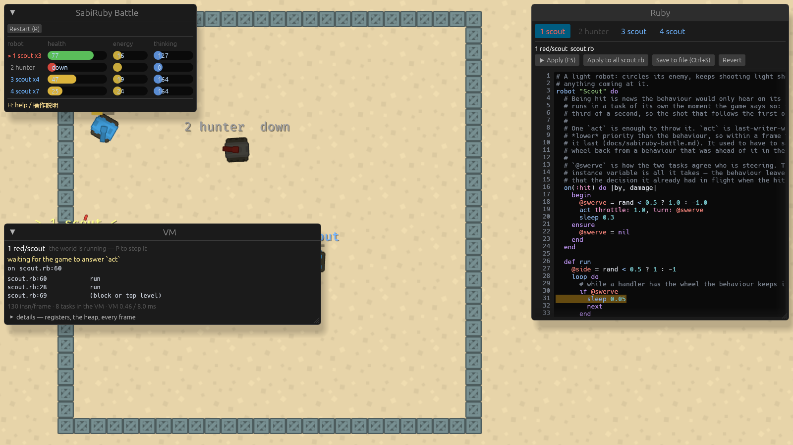

# SabiRuby Battle (`sabibots`)

Two robots in a square arena. Each robot's brain is one `.rb` file, running as a task in the one
VM the game keeps, and every move it makes goes through a question the game answers.

## Two kinds of script

A **robot** is one file with a brain in it. A **match** is one file that runs the whole game: it
puts the robots on the field, watches what happens to them, and decides when it is over. Both are
tasks in the same VM, written in the same way — ask the game something, wait for the answer — and
the game does only what it is told.

```ruby
# ruby/matches/training.rb
match "Training", noise: 0.3 do
  team :red,  robots: %w[scout hunter]
  team :blue, robots: %w[scout scout]

  # from 20 s on, the walls close in one crate every 2 seconds
  rule(:sudden_death, after: 20, every: 2.0) { |m| m.shrink 1 }

  on_destroyed { |file, team| Rubevy.log("match: #{team}'s #{file} is down") }
end
```

The match asks for `spawn` (a robot file, a team, a place), `board` (every robot with its team,
hp and position), `events` (what has happened since it last looked), `clock`, `shrink` and `win`.
Nothing about the rules is in the Rust: the number of teams, when the walls move, what counts as
a victory — all of it is in that file, and saving it starts the match again.

`ruby/match_prelude.rb` is the DSL, the same way `ruby/prelude.rb` is the robots'.

## The boundary

How a question travels from the Ruby to the system that answers it, and why this is smoother than
with the C mruby, is written up (in Japanese) in rubevy's
[`docs/rust-bridge.ja.md`](https://github.com/sabiruby/rubevy/blob/main/docs/rust-bridge.ja.md).

The game owns the world; Ruby owns the decisions. What a robot gets is deliberately raw — a tank's
controls and noisy readings — so there is room to write a brain that is better than another one.

| Ruby asks | the game answers | what it does |
|---|---|---|
| `ask("status")` | `[x, y, hp, team, heading, speed, turret, energy, cooldown, arena, time]` | the robot itself |
| `ask("radar", range)` | the status row, then `[id, team, hp, x, y, vx, vy, heading, turret, distance, bearing]` per robot | every other robot still running within range, friends included, through the match's noise |
| `ask("incoming", range)` | `[[x, y, vx, vy, distance], …]`, nearest first | shots from other teams on their way |
| `ask("act", throttle, turn, aim, power)` | `[fired, energy, cooldown]` | the controls; any of them `-999` to leave as it is |
| `ask("seed")` | a number | a robot's own dice, rolled from the match's, for `srand` |

And what only the match asks for:

| the match asks | the game answers |
|---|---|
| `ask("rules", noise, seed)` | how noisy radars and guns are; the dice (`-1`: the clock) |
| `ask("spawn", file, team, x, y)` | the new robot's id; it comes with its own brain |
| `ask("board")` | `[[id, team, hp, x, y], …]` |
| `ask("events")` | `[[kind, id, other], …]` since the last call — `0` is "down" |
| `ask("clock")` | seconds since the match started |
| `ask("shrink", crates)` | every wall moves in by that many crates (down to 7 a side); the new half-width |
| `ask("win", team)` | the result, for the HUD |

Every one of them parks the robot's task until the answer comes back (`ScriptWorld::answer`), so
a robot waiting for its radar costs nothing and the other robots keep running. Nothing is a
callback and nothing polls; a robot reads as ordinary sequential Ruby:

```ruby
loop do
  target = nearest_enemy(60)
  if target
    angle = lead(target, 0.9)
    act throttle: 0.5, turn: steer_to(target.bearing), aim: angle,
        fire: aimed?(angle) ? 0.9 : nil
  end
  sleep 0.08
end
```

**A question costs one frame**, measured (`docs/worklog/2026-09-17-battle-followups.md`): the
task asks and parks, the request reaches the game with that frame's commands, `answer_requests`
answers it in the same frame, and the scheduler wakes the task on the next one.

It cost *two* until 2026-09-17, and the fix was one line. `answer_requests` is an ordinary system
of this game, and nothing said where in the frame it ran; dropped between rubevy's `tick_scripts`
and `drain_commands` it could not see a question until the frame after it was asked. rubevy now
publishes the three `SystemSet`s it builds its own frame out of, and the game's chain of thirteen
systems says `.in_set(RubevySet::Answer)` — the set that runs after the scripts have been ticked
and their questions collected. Measured with a robot that does nothing but count frames, the same
one as the study below: 2.0 frames a question before, 1.0 after.

**The match got busier**, and this is worth knowing before anyone reads a robot's numbers as its
own doing. A scout's decision is three questions, so its loop went from about 150 ms round
(6 frames of questions plus its `sleep 0.05`) to about 100 ms: every robot aims and fires half
again as often. Counting the hits the selftest watches over five 20-second headless runs, it went
from 11–17 a run to 15–27. The robots were not retuned for it — they are the same files — and the
difference is entirely in how often each of them gets to decide.

Either way the cost is per *question*, which is why `act` sets all four controls at once and
`radar` brings the robot's own status back with it: a brain that asked one question per control
would react several frames late. `Rubevy.ask` also allows an answer that comes frames later (a
path request, an asset load), and the robot simply waits.

### Why not `Rubevy.entity[:Transform]` and `Rubevy::Proxy`

rubevy has another way to reach the world — a component by name, and a proxy that turns any method
call into a question — and the obvious question is whether the robots would read better written
that way. They were measured against each other with a robot that does nothing but count frames
(it and the numbers are in `docs/worklog/2026-09-16-showpieces-d2-d3.md`). One decision of the
scout, with three other robots on the field:

```ruby
# as it is: three questions, three frames
target = nearest_enemy(45)                                   # ask("radar", 45)  — 1 frame
threat = incoming(18).find { |shot| on_collision?(shot) }    # ask("incoming",18) — 1 frame
act throttle: 1.0, turn: steer_to(heading), aim: angle, fire: 0.3   # ask("act") — 1 frame
```

```ruby
# over the ECS bridge: nine reads and a question — ten frames — and it knows less
me    = Rubevy.entity
here  = me[:Transform]                     # 1 frame — where I am, which way I point
mine  = me[:Robot]                         # 1 frame — hp, energy, cooldown: a component
foes  = Rubevy.find(:Robot)                # 1 frame — every robot in the world, near or far
seen  = foes.map { |f| [f[:Transform], f[:Robot]] }   # 2 reads each: 6 frames
robot = Rubevy::Proxy.new("robot")
robot.act(1.0, turn, angle, 0.3)           # 1 frame — a proxy call *is* `Rubevy.ask`
```

One decision of the scout, three other robots on the field. The per-question costs are measured;
the rows are their sums:

| | questions per decision | frames |
|---|---|---|
| `ask("radar")` / `incoming` / `act` (today) | 3 | 3 |
| `Entity#[]` + `Proxy`, positions only | 5 | 5 |
| `Entity#[]` + `Proxy`, everything the scout uses | 10 | 10 |

* **A component read is a round trip, and there is one per component per entity.** A question can
  carry a whole table back (`radar` answers every contact with its position, velocity, heading,
  distance and bearing in one `Answer::Rows`); `e[:Transform]` answers one component of one
  entity. What the boundary costs is questions, and the component form asks one per fact.
* **A component read is no quicker than a question any more** — both are one frame. It used to
  be one against two, because rubevy answers the four kinds it reserves itself
  (`component.get`, `component.has`, `components`, `entities.with`) in a system of its own and
  the game's answers were arriving a frame late. The difference was never the mechanism, only
  where in the frame the answering ran; both now run in `RubevySet::Answer`.
* **`Rubevy.find` walks the world.** In this game it answers 345 entities (every crate of the
  wall, every shot, every nameplate) unless the game registers a component that means "a robot" —
  and `radar` already answers "the robots within 45 units, as this robot can see them".
* **The noise would be lost.** How far a radar reading strays is a rule of the match, and the
  rules live in Rust (rubevy's `rust-bridge.ja.md`). A component read is the truth; a radar
  reading is what a robot can know. `Contact#distance` and `#bearing` are computed on the game's
  side for the same reason.
* **`Rubevy::Proxy` is `Rubevy.ask` with a method name on it** — `proxy.act(…)` is
  `Rubevy.ask("robot.act", …).pop`, measured at the same one frame. It reads well, and it hides
  the one thing a robot's author must see: which calls wait. `act` is a word that says "do this";
  `robot.act` is a word that says "ask and wait", written to look like neither.

So the robots stay as they are. The bridge's other half is not unused — a robot *is* an entity, and
the VM panel and the reflexes both go through it — but for a brain's own decisions, one question
that brings a table back beats nine that each bring one field.

## A tank, not a cursor

The first version had `thrust(dx, dy)` (move in any direction, at once) and `fire(dx, dy)` (shoot
in any direction, at once) and `scan` (the nearest enemy, exactly). Every brain written with them
came out the same, because there was nothing to be good at: pointing at the enemy was already the
best aim, and moving sideways was already the best dodge.

Now a robot is a tank:

* **The hull turns at a limited rate** (`turn`, -1..1 of 2.6 rad/s) and the robot moves only along
  it (`throttle`, -1..1; reverse is slower). Speed takes about a fifth of a second to build and
  to die away. Getting out of the way of a shot means turning first.
* **The turret turns on its own**, towards the angle it was given, at 4 rad/s. A robot can drive
  one way and shoot another, but a turret that has to swing round is a turret that is not
  firing.
* **A shot's power** (0.2..1) trades damage (4..16) for speed (55..30), reload (0.3..0.8 s) and
  energy. A light shot is hard to dodge and does little; a heavy one hurts and can be seen coming.
* **Energy** (100) comes back at 12/s. Full throttle costs 9/s, a shot 16 × (0.25 + power). A robot
  that fires everything it has cannot also run, and one with none left crawls at a third of its
  speed and cannot fire at all.
* **Shots fly**, so a moving target has to be led: aim where it will be, not where it is.
* Tanks push each other apart instead of driving through each other, and a team's shots pass over
  its own robots.

## Randomness

`match "Training", noise: 0.3, seed: 7 do … end`:

* `noise` (0..1) blurs the radar — positions by up to `noise × distance × 5%`, velocities too — and
  the shots from `incoming`, and spreads every shot by up to `noise × 0.1` rad on top of a small
  spread every gun has. A robot far away is a guess; a robot close is a fact.
* `seed` fixes the game's dice. Each robot's `rand` is `srand`ed from them when it starts, so a
  robot that flips coins (the scout's circling direction, the hunter's wandering) flips the same
  coins in a seeded match. Leave it out and every match is different. A replay with the same seed
  is alike rather than identical: frame times still vary, and so do the moments the questions are
  answered.

## The DSL

`ruby/prelude.rb` has two halves.

The first is **what the game offers**, as thin as it can be: `status`, `me` (the last status seen,
without asking), `radar(range)` → `Contact`s, `incoming(range)` → `Shot`s, and
`act(throttle:, turn:, aim:, fire:)` with `drive`, `aim`, `fire`, `stop` as one-control shorthands.
`Status`, `Contact` and `Shot` are plain classes over the rows the game answers.

The second is **a library written on top of it in plain Ruby**, which a robot can use, copy and
change, or ignore:

| helper | what it works out |
|---|---|
| `angle_diff(a, b)`, `angle_to(x, y)`, `distance_to`, `angle_to_center` | geometry from where the robot is |
| `steer_to(angle)` | a `turn` value that brings the hull round, gently as it gets close |
| `enemies(range)`, `nearest_enemy(range)` | the radar, filtered |
| `lead(target, power)` | where to aim so a shot of that power meets a target that keeps its course |
| `aimed?(angle, tolerance)` | the gun is ready and the turret is close enough |
| `near_wall?(margin)` | time to turn back in |
| `on_collision?(shot)`, `dodge_angle(shot)` | whether a shot will hit if nothing changes, and which way is across its path |
| `wander_turn` | a turn that keeps a direction for a while, then picks another at random |

None of the helpers asks the game anything except through `radar`: they compute a number, and the
robot's `act` sends them all at once.

`robot "Name" do … end` is `Class.new(Robot)` with the block `class_eval`'d into it. So a robot
file is a class body: `def run` is the brain, other `def`s are its own helpers, and instance
variables are the robot's memory between frames.

The two robots that come with the game:

* **scout** circles its nearest enemy (the side flips now and then), dodges a shot that is on
  course to hit it, and fires light, fast shots (power 0.3) while it has energy to spare.
* **hunter** drives at its enemy until it is 18 away, backs off slowly from there, and fires heavy
  shots (0.9) when its turret is on the lead angle; with nothing on the radar it wanders with its
  turret sweeping.

## Reflexes

A brain is one loop, so a robot sleeping between decisions would notice a hit only on its next
pass, up to 0.05 s later. `reflex(:hit) { … }` is a block that runs in **a task of its own** the
moment the game says it happened — the first place a single robot uses more than one of
mruby-task's tasks.

```ruby
robot "Scout" do
  reflex(:hit) do |by, damage|      # `by` is the attacker's name, `damage` a number
    @swerve = rand < 0.5 ? 1.0 : -1.0
    act throttle: 1.0, turn: @swerve
    sleep 0.3
    @swerve = nil
  end

  def run
    loop do
      next sleep(0.05) if @swerve    # the reflex has the wheel
      …
    end
  end
end
```

| what | who says it |
|---|---|
| `reflex(event) { \|*args\| … }` in the class body | registers it; up to `Robot::REFLEX_SLOTS` (4) per robot |
| `ScriptWorld::publish(Some(entity), "hit", …)` in `move_bullets` | the game, on every hit that lands |
| the payload | `[by, damage]` — `by` is the attacker's name as the scoreboard writes it (`2 red/hunter`), `damage` the hit points taken |

The attacker crosses as a **name** rather than as an entity or an id: it is what a script can log,
compare and remember without asking the game anything, and the radar already hands out ids for
everything that needs one.

### How one is started

`run_robot` (in `prelude.rb`) does it, before `bot.run`:

* **The subscription is taken in the robot's own task.** `Rubevy.subscribe(:hit)` answers a queue
  the game pushes onto, and it belongs to the entity whose task asked. A task made with
  `Task.new` carries no entity, so rubevy refuses to subscribe for it — the queue is taken here
  and handed to the block that reads it.
* **The new task carries the robot's entity by itself.** A reflex has to be able to `act`, and
  `act` from a task with no entity is a question from nobody that the game answers `nil`. The
  prelude used to copy the `@rubevy_entity` the scheduler puts on the robot's own task; since
  rubevy `9104f7c` a task made with `Task.new` inherits it from the task that made it (rubevy's
  `docs/host-api.md`, *Events*), so there is nothing here to copy.
* **Its priority is the brain's plus 20** — a *lower* priority, since a smaller number is looked
  at first. That is on purpose, and the next section is why.

### Two tasks, one tank: last writer wins

Both tasks call `act` on the same robot, and `act` simply sets the controls: **whichever question
the game answers last in a frame is what the tank does.** There is no locking and no arbitration,
so the rule that matters is which of the two asks last:

* **A reflex is the lower priority, so it runs last in a frame** — its `act` reaches the game
  after the brain's, and the tank obeys the reflex. Being quick off the mark is what *starts* a
  reflex the same frame the hit lands; being last in the frame is what makes it stick.
* It was the other way round at first (the plan asked for a higher priority, thinking "sooner" was
  "stronger"), and with last-writer-wins a reflex that runs first always loses the tie. The scout
  coped by saying `act` again every 0.05 s for the whole swerve — a workaround that is gone now
  that the order is right: one `act` and a `sleep 0.3`.
* The brain usually has a question in flight when the hit lands (it looked at `@swerve`, then
  asked for its radar), and the `act` it makes when that answer comes back would undo the swerve
  a frame or two later. That is the part the priority cannot fix.

So a reflex that wants the wheel for longer than a frame says so, and the brain leaves the
controls alone while it does — `@swerve` in `scout.rb` is that agreement, and it is an ordinary
instance variable because both tasks are the same object's. A reflex that only sets a flag, logs,
or fires once needs none of this.

What the order is worth, measured with the selftest's own check (`the heading changed within
0.3 s of the hit`, 20 s headless runs): with the reflex at the lower priority and one `act`,
five runs out of five pass and every swerve turns the hull at least 0.48 rad. With the priority
the other way round and the same one `act`, two runs out of three fail. The old
say-it-again-every-frame reflex passes either way, but turns as little as 0.25 rad when it has to
fight the brain for the wheel.

The reflexes of one robot share one task, on purpose: a robot hit again while its reflex is still
running gets the second reflex when the first has finished, rather than two swerves fighting.

### Where it shows

* **The scoreboard**, next to the robot's brain: `1 scout !2` while a reflex is running,
  `1 scout x2` between them — the number is how many have run, so a screenshot (`--shot`) shows
  it too. The prelude tells the game with `Rubevy.ask("reflex", :begin)` / `:end`, and never pops
  the answer: **a question nobody waits for is a command**, which is what keeps the mark from
  costing the reflex a frame.
* **The log**, one line per reflex: `Scout: reflex hit ["2 red/hunter", 14.8]`. `--headless` shows
  them, which is how this is checked where there is no window.

### What stops one

Two different endings, and only one of them is the robot's own.

`run_robot` terminates its reflex tasks in an `ensure`, which covers the brain ending by itself or
raising. It does **not** cover the usual case: when a robot goes down, or its file is saved, the
game takes its `ScriptTask` away and the VM terminates the brain's task outright — and a task
terminated from outside does not unwind, so that `ensure` never runs.

What ends a reflex task then is **the subscription closing**. rubevy closes the queue when it lets
a subscription go, and a `pop` waiting on a closed subscription raises `Rubevy::Unsubscribed`
(rubevy `9104f7c`); the task unwinds through its own `rescue` and is gone:

```ruby
begin
  loop { args = queue.pop; … }
rescue Rubevy::Unsubscribed        # the robot is gone; end here rather than park for ever
  Rubevy.log "#{bot.name}: reflex #{event} off"
  Rubevy.ask("reflex", :off)
end
```

Before that, a reflex task was left parked on a queue nobody would publish to again — measured
with a probe task listing `Task.list` through a match: after `3 blue/scout` went `DORMANT` its
`Scout-hit` task was still there, `WAITING`, costing a context and a task object per robot per
life. The check that it no longer is runs in the selftest: every robot that has been down for
more than half a second must have had as many reflex tasks end as it registered reflexes
(`--headless` prints `1/1 reflex tasks ended` per robot, and `reflex hit off` in the log).

### What it cost to get right

`instance_exec`, `send` and `Method#call` all run the block in a **nested run loop** of the VM, and
a task cannot be parked across one: the first `act` inside a block called that way dies with
`blocking pop cannot be called from within a C function boundary`. So `reflex` turns the block
into an ordinary method of the robot's class (`define_method`), and `run_reflex` calls it by a
name written out in the source — which is why there is a fixed number of slots
(`Robot::REFLEX_SLOTS`, 4).

That limit is about the nested run loop and nothing else. The two other things this cost — a
child task with no entity, and a reflex task nobody ended — were rubevy's to fix and rubevy has
fixed them; the slots stay, because a `case` over names written in the source is still the only
way to call a block and be able to park inside it.

## The DSL

The prelude is put in front of the robot's file and the two are compiled as one program, which is
why a robot file needs no `require`. Reading it as one program is also what makes reloading a
single file easy.

## Reloading

`rubevy-arena`'s `Watch` watches `ruby/` with `notify`. On a write the game recompiles that robot
(prelude + file) and gives the entity a new `Script`, dropping the old `ScriptTask`: the robot
starts over with the new brain, the world is untouched, and the other robot never notices. Saving
`prelude.rb` reloads every robot.

A compile error is reported in the HUD line and the log, and the robot keeps its old brain.

## Fairness, and why a bad robot cannot ruin the match

mruby-task gives each task a timeslice counted in instructions (the VM's own scheduler), and
rubevy hands the scheduler a budget per frame. A robot that never sleeps is preempted and resumed
next frame; a robot that raises has its exception become the task's result, which the game reports
and the match carries on. Neither can stop the frame.

The instruction count has one blind spot: a block that a native is waiting for cannot be switched
out. `Array.new(1) { loop { } }` in a robot's `run` used to freeze the whole game. Since
2026-09-14 each frame also runs under time limits on a clock (rubevy's `frame_time`, 8 ms, and
`overrun`, 50 ms): past the second, such a robot gets `Task::Overrun`, its brain ends ("script
failed: #<Task::Overrun …>" in the HUD), and the other robots fight on. Checked headless with that
line put into `hunter.rb`, and the browser build still passes its checks with the clock (Bevy's
`Instant`) in place. The slices themselves are still counted in instructions, so a robot thinks
the same amount on a fast machine as on a slow one.

## The scoreboard

The panel at the top left has one row per robot, in words and bars:

| column | what it is |
|---|---|
| robot | its number and brain (`1 scout`, `*` if it runs an applied brain, `!n` while a reflex is running and `xn` between them), in its team's colour; click it to show it in the editor |
| health | a bar, green, yellow below half, red below a quarter; `down` when it is out |
| energy | a bar out of 100: driving and firing spend it, time brings it back |
| thinking | the instructions its Ruby runs per frame, averaged over about a second; a timeslice's worth (3,000) fills the bar |

Each robot also has a small health bar over it, under its name.

The first version showed `prelude.rb:15` and a per-frame instruction count. Both were true and
neither was readable: a brain passes through a dozen lines a frame and sleeps most frames, so the
"current line" jumps and the count flickers between 0 and a hundred. A `mostly doing` column (the
line it had spent the most time on lately) replaced it and went the same way — two lines that
take about the same time trade places many times a second — and so did the editor's
`(in prelude.rb:82)`. What is left is what can be read: the editor's shading, which fades over
about a second, and the smoothed instruction count.

The scoreboard and the editor are windows with title bars: drag them anywhere, and fold the
scoreboard away with its triangle. The scoreboard starts at the top left, the editor at the top
right. The scoreboard's button starts the match over (below).

## Telling the robots apart

Every robot has a number — the order the match put it on the field — and it is the same number
everywhere: over its head (`3 scout  hp 86`, in its team's colour), at the start of its HUD row
(`3 blue/scout`), in the editor's title, and on the key that picks it (`3`). The robot the editor
is showing is marked over its head: `> 1 scout  hp 100 <` in yellow. The text has a dark copy
behind it so it reads on the sand, and it follows the robot rather than being its child, so it
does not turn with the hull.

While the editor is open the camera slides so the arena sits in the part of the window the editor
does not cover; hide the editor (`F1`) and the arena comes back to the middle.

## The editor

The right-hand window is an editor (egui, through `bevy_egui` 0.42 — the release built for Bevy
0.19). It shows the watched robot's own file and puts a band behind **the line of that file its
brain is standing on**:

```
1 red/scout  scout.rb
   7      target = nearest_enemy(45)        ← shaded
```

What is typed stays **in memory** until you say otherwise. Trying something in a running match
should not rewrite the project on disk — and a build whose files cannot be written (a packaged
game, a browser) gets the same editor. Four buttons decide what happens to the text:

| button | key | what it does |
|---|---|---|
| **Apply** | F5 / Ctrl+Enter | compiles the text and restarts **this robot only** with it; the file is untouched |
| **Apply to all *file*** | | the same, for every robot whose brain is that file |
| **Save to file** | Ctrl+S | writes the text to the file; robots on the file pick it up |
| **Revert** | | forgets the edits and puts this robot back on its file |

A robot running an applied brain is marked `*` — `3 scout*` on its button and over its head, and
`scout.rb*` in the editor's title. The file watcher leaves such robots alone: an edit made in
another editor reaches the robots on the file, not the one you are experimenting with. A text that
does not compile is not applied; the editor says why and the robot keeps the brain it has.

Closing the game forgets applied brains that were not saved. Edits typed and not applied are kept
per robot while the game runs, and the editor lists the robots that have some.

The editor itself does no file I/O (`EditorAction` is what it hands the game), so the rules above
live in the game (`do_editor_actions`), and another game can choose different ones.

`SABIBOTS_SELFTEST=1 docker/run.sh` drives these buttons the way a click would and checks the
outcome: Apply reaches only the shown robot and writes nothing, Apply to all reaches the robots on
the same file and no others, Revert puts the shown robot back on its file. Save is left out of it
on purpose, since it writes to the repository.

Along the top of the editor is a button per robot (`1 scout`, `2 hunter`, … in team colours, faded when the robot is down); click one to show its brain. `1`–`8` do the same from the keyboard, `Tab` moves on, `F1` hides the editor. Switching to another file keeps what was typed into the one being left: unsaved edits are held per file and come back when you return to it, and the editor lists which files have them. Keys typed into the editor stay the
editor's: a `2` in the code does not switch robots (`EguiWantsInput`).

The line that is shaded is the innermost frame **in the robot's own file**, which is not the
innermost frame: a robot waiting for its radar stands a few frames deep inside `prelude.rb`. The
VM answers the whole stack (`Vm::task_frames`) and the game picks the frame in the file it shows,
accumulating it into the shading every frame.

Two details that make it a listing rather than a text box: it never wraps (a custom layouter sets
the wrap width to infinity), so each row of the gutter is one line of the file; and the shading is a
background on that line's text section, so it moves with the text as the file is edited.

The editor lives in `rubevy-arena` (`Editor`, `EditorPlugin`) so the other games get it for free.
The older read-only panel (`CodePanel`, Bevy UI only) is still there for a game that does not want
egui.

## The VM panel

`F2` shows and hides it; it is open from the start, so a screenshot has it. It is the browser
playground's "VM の状態" pane in the game's own window, about the robot the editor is showing.



* **The frames the brain is standing in, innermost first.** A robot waiting for a scan is four
  frames deep — `Task::Queue#pop`, `Rubevy.ask`'s wrapper, `radar` in the DSL, then its own
  `scout.rb:36` — and seeing that stack is seeing why waiting costs nothing: it is an ordinary
  Ruby call chain in a context of its own, parked, not a callback that lost its place.
  A frame of mrblib (`Kernel#loop`, `Task::Queue#pop`) says `(no debug info)`: it is there, it
  just carries no line table.
* **The registers of one frame**, named from the debug info — `target`, `threat`, `heading` —
  with the class and the value of each. `R0` is `self`. The panel follows the innermost frame of
  the robot's *own* file by default, because the DSL's locals are not what the author came for;
  clicking a row pins that one instead.
* **The heap and the collector**: live of total, what has been allocated since the last
  collection and the threshold that will start the next, how many collections there have been,
  and what survived the last. Watching that climb and drop while a robot fights is what a
  garbage collector is.
* **How many contexts the VM holds, and how many are still live.** One per task: four brains,
  their reflexes, the match. When a robot goes down its two contexts stop and the count falls —
  which is how the reflex-task leak in *What stops one* was seen to be gone.

**`P` pauses the scripts** by giving the scheduler a budget of 0 instructions for the frame: the
VM runs nothing, so the numbers stand still while they are read. The game keeps drawing and the
tanks keep rolling on the controls their brains last set — it is the Ruby that is stopped, not the
match.

The scheduler's clock stops with it. It did not at first, and a pause used to end with every
`sleep` in the VM coming due at once, because the frames the pause lasted were still counted
against them; rubevy `fa37eaa` made a budget of 0 skip the tick as well, so a robot half way
through a `sleep 0.05` is still half way through it when the budget comes back. There is nothing
for the game to call: setting the budget to 0 is the whole of it. The selftest measures it —
`nothing that was sleeping woke on the resume frame` — as the ticks the earliest sleeper still has
to wait (`Vm::task_next_wakeup_ticks`), which must be the same number after half a second paused
as it was when the pause began.

Nothing in the panel runs Ruby: sabiruby renders a value in Rust (`Vm::render`), so looking at a
robot cannot move it, allocate, or raise. The cost is that an object with an `inspect` of its own
shows the default form.

It reads `Vm::snapshot` and `Vm::task_frames`. Joining the two — *which* of the VM's contexts is
this task's — has no entry point in the VM yet, and `rubevy-arena`'s `inspect.rs` gets it out of
the way the VM renders a task (`#<Task 12 ctx=3>`) until sabiruby has a `task_context` or a
`task_snapshot`. The panel lives in `rubevy-arena` (`VmInspector`, `VmInspectorPlugin`), so the
other games get it too.

## Starting again

`Restart (R)` on the scoreboard — `Play again (R)`, once there is a winner — starts the match over
without restarting the game. Everything on the field is despawned (robots, and with them their
barrels, names and bars; shots; blasts; the match's own entity), the arena goes back to its size,
and the match script is started again, so it reads `training.rb` afresh and spawns the robots as
it did the first time.

Despawning is also what stops the old scripts: rubevy terminates a task when its entity goes (or
its `ScriptTask` is removed). Until that was added a reload left the old brain running beside
the new one, asking for the same body — invisible, since nothing showed it any more. A question
asked just before a restart is answered with `nil` and nobody is waiting for it.

A brain applied in the editor and not saved comes back with the robot's number: number 3 is still
the third robot the match spawns. Edits typed and not applied are dropped.

A robot that goes down has its task stopped the same way, so a wreck no longer spends
instructions on a body that cannot move.

`SABIBOTS_SELFTEST=1` ends by pressing Restart and checking that there are four robots again (not
eight), all at full health, that an applied brain came back and a reverted one did not, and that
the wall ends on its corners.

## Blasts, and the view following the arena

A robot that is down turns grey — its hull swapped for Kenney's dark one, its name and its
editor button greyed — so what is still in the fight is what has colour. A hit leaves a small puff
and a robot going down a large one (Kenney's `explosion1` / `explosion3`),
growing and fading over a quarter of a second or 0.7 s.

The window is 16:9 and the arena square: the camera keeps the arena's height (plus a little
floor past the wall) in view, and the floor reaches past the wall sideways. When the match closes the walls in, `ArenaSize` changes and the wall of crates is rebuilt at the new edge. The crates are spaced about 2.6 apart with the step stretched so each side is a whole number of them, so every side ends exactly on a corner (a fixed step used to leave the top and right sides a crate past the corner). The walls close in a crate at a time: `shrink(1)` takes one crate off each end of every side, the crate size stays the same, and the arena gets smaller in steps the eye can follow — 25 crates a side at the start, 23, 21, … down to 7, where it stops. A rule with `every:` repeats, which is how the match does it gradually (the first version shrank by 8 and then 6 units at once, which looked like a jump rather than walls moving). The camera stays where it was framed, so the walls are seen moving in; zooming to follow them made the shrink hard to notice, and it is off by default (`ArenaPlugin::follow_shrink`).

## Seeing it where there is no window

`cargo run -p sabibots -- --shot shot.png 5` opens the window, waits five seconds, writes a PNG
and exits. With `docker/run.sh` (see `docs/wsl-gpu.md`) that works on a machine with no GPU
driver, which is how the screenshots in this repository were made.

## The picture

Kenney's *Top-down Tanks Remastered* (CC0), a dozen files of it in `sabibots/assets/sprites/`:
tank hulls for the robots, their own coloured shots, sand tiles for the floor and metal crates
for the wall, and a barrel on each hull that turns on its own (Kenney has red and blue barrels;
the other teams get a tinted blue one). The hull points where the tank is heading and the barrel
where the turret is, which makes the Ruby's decisions legible at a glance — a scout circling its
enemy with its gun turned inwards looks like exactly that.

Bevy looks for assets next to the executable, which is not where a workspace puts them, so the
game points `AssetPlugin` at its own `assets/` directory.

## What it does not do yet

* **Sound.**
* **Reflexes for anything but a hit.** `reflex` takes any event name, but `"hit"` is the only one
  the game publishes today.
* **Keeping edits that were typed and not applied across a restart.** Applied brains are kept.

## Running

```
cargo run -p sabibots                    # window
cargo run -p sabibots -- --headless 15   # 15 seconds, result on stdout, no GPU needed
web/build.sh && web/serve.sh             # in a browser (docs/web.md)

SABIBOTS_SELFTEST=1 cargo run -p sabibots -- --headless 25   # the reflex check
SABIBOTS_SELFTEST=1 docker/run.sh                            # that, and the editor's
```

`SABIBOTS_SELFTEST` turns on two sets of checks. The editor's need a window (above), and end with
`P`: pressing it must give the scripts a budget of 0 and stop them running, nothing that was
sleeping may wake on the frame the budget comes back (the pause lasts half a second, ten times a
brain's `sleep 0.05`), and pressing `P` again must start them.

The reflex check needs a fight rather than a mouse, so it runs headless as well:
every hit taken by a robot that has a reflex, is still standing and is not already in the middle of
one is noted with the way it was facing, and 0.3 s later it must have run a reflex and turned by
more than 0.2 rad at some point in between. A robot destroyed inside those 0.3 s is not counted at
all — the game takes its task away and zeroes its controls, so it is not a robot that failed to
swerve. At the end, every robot that has been down for more than half a second must have had as
many reflex tasks end as it registered reflexes.

The headless mode runs the same systems as the window and prints each robot's hp and position at
the end, then the VM panel's own numbers as text — the frames each brain is standing in with the
locals of the innermost few, the heap, and how many contexts are live. It is how the game is
checked where there is no GPU.

| key | what it does |
|---|---|
| `1`–`8`, `Tab` | which robot the editor and the VM panel are about |
| `F1` / `F2` | the editor / the VM panel |
| `P` | pause the scripts (budget 0) |
| `F5`, `Ctrl+Enter` / `Ctrl+S` | apply the edited brain / save it to its file |
| `R` | start the match over |
